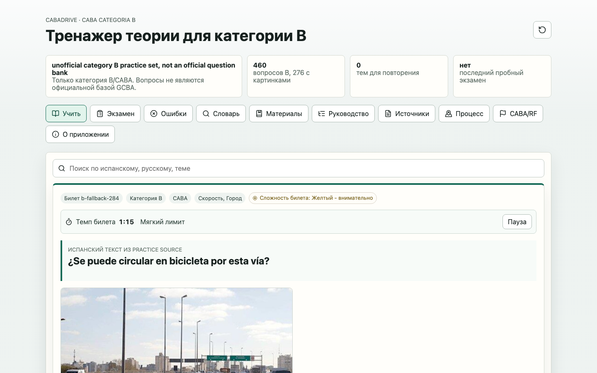
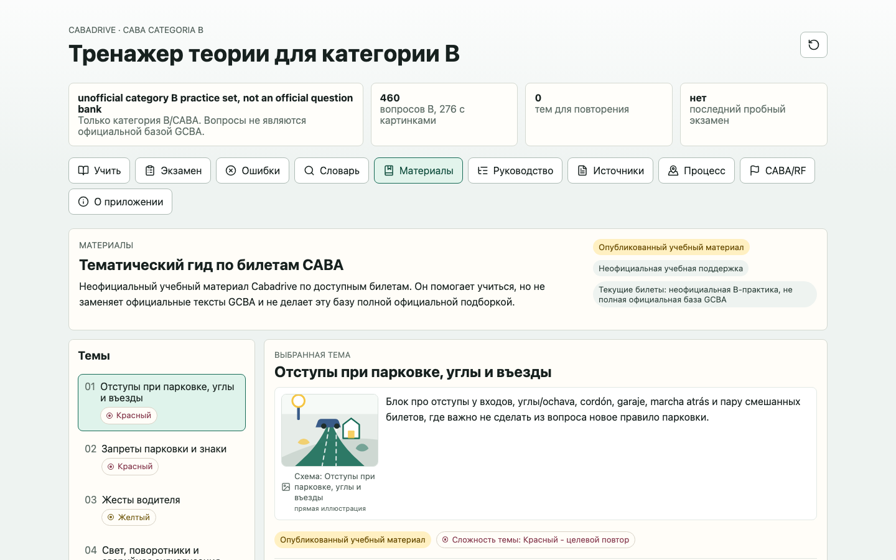
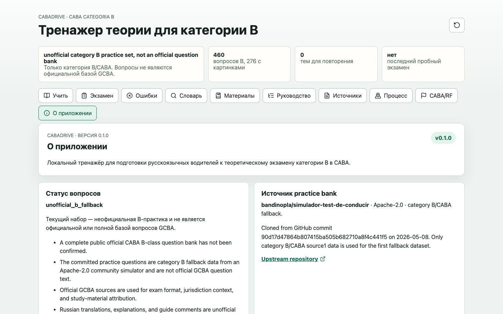

# Cabadrive

Cabadrive — локальный веб-тренажёр для опытных русскоязычных водителей, которые готовятся к теоретическому экзамену категории B в CABA. Официальный испанский материал остаётся первичным, а русские переводы, объяснения и учебные подсказки явно обозначены как неофициальная поддержка.

**English.** Cabadrive is a local-first web trainer for experienced Russian-speaking drivers preparing for the CABA category B theory exam. Official Spanish source material remains primary; Russian translations, explanations, and study aids are clearly labelled as unofficial support.

> Текущие 460 практических вопросов — неофициальный community fallback для категории B, а не официальная или полная база вопросов GCBA. Полная публичная официальная база категории B не подтверждена.

## Экраны

| Учить | Материалы | О приложении |
|---|---|---|
|  |  |  |

## Быстрый старт пользователя

Нужен только Docker. Node.js и pnpm на хосте не требуются.

```bash
make build
make up
```

Откройте [http://localhost:5173](http://localhost:5173). После работы остановите только этот compose-проект:

```bash
make down
```

Собранное приложение работает локально и сохраняет прогресс в браузере. Runtime backend, аккаунты и облачная синхронизация отсутствуют.

## Возможности и ограничения

- обучение, симуляция экзамена, разбор ошибок, словарь и тематические материалы;
- локальные официальные первоисточники и интерактивное русское руководство;
- офлайн-работа после сборки и загрузки приложения;
- текущие вопросы происходят из неофициального community-источника, поэтому приложение не заявляет официальную или полную базу GCBA;
- русские переводы, объяснения, руководства и иллюстрации — неофициальная учебная поддержка, а не официальный текст.

## Разработка и проверка

Процесс изменений описан в [`AGENTS.md`](AGENTS.md) и [`CONTRIBUTING.md`](CONTRIBUTING.md). Изменения попадают в `main` только через pull request.

```bash
pnpm run validate:attribution
pnpm run validate:content
pnpm run test
pnpm run build
pnpm run test:e2e
pnpm run preflight
```

## Структура репозитория

- `src/` — React/Vite SPA;
- `content/` — вопросы, официальные архивы, переводы и локальные assets;
- `tests/` — Node и Playwright проверки;
- `scripts/` — детерминированные валидаторы и build tooling;
- `docs_project/` — актуальная продуктовая и техническая документация;
- `specs/` — feature memory и evidence отдельных изменений.

## Лицензия и атрибуция

Cabadrive-owned code and documentation are available under the [Apache License 2.0](LICENSE). Bundled content keeps its own terms and is not relicensed by the root license; see [`NOTICE`](NOTICE) and the [third-party and official-source inventory](licenses/THIRD-PARTY-NOTICES.md).

Практический набор категории B derived from [`bandinopla/simulador-test-de-conducir`](https://github.com/bandinopla/simulador-test-de-conducir) at pinned commit `90d17d47864b807415ba505b682710a8f4c441f5` under Apache-2.0. Это неофициальный и неполный fallback, не банк вопросов GCBA.

Repository: [github.com/cucumberfalse/cabadrive](https://github.com/cucumberfalse/cabadrive)
