# DECRETO 779-95 ANEXO L

Anexo al artículo 22.

ANEXO L

SISTEMA DE SEÑALIZACION VIAL UNIFORME

(Anexo sustituido por art. 24 del Decreto N° 196/2025 B.O. 18/3/2025. Vigencia: a partir del día siguiente al de su publicación en el BOLETÍN OFICIAL.)

CAPÍTULO I

PRINCIPIOS GENERALES

1. CONCEPTO. EL Sistema de Señalización Vial Uniforme comprende la
descripción, significado y ubicación de los dispositivos de seguridad y
control del tránsito, incluidos en el presente código y la consecuente
reglamentación de las especificaciones técnicas y normalización de
materiales y tecnologías de construcción y colocación y demás elementos
que hacen a la calidad y seguridad de la circulación vial.

Dicho señalamiento brinda información a través de una forma convenida y
unívoca de comunicación, destinada a transmitir al usuario de la vía
pública órdenes, advertencias, indicaciones u orientaciones, mediante
un lenguaje que debe ser común en todo el país, según los principios
internacionales. Con el fin de mantener el criterio de unicidad y
complejidad, se incluyen señales (como las realizadas mediante barreras
o semáforos ferroviales) propias del sistema operativo del ferrocarril,
pero destinadas a la circulación carretera.

La señalización ya existente que difiere de la aprobada en este
reglamento será sustituida por la nueva cuando aquella deba ser
renovada por deterioro o vencimiento del período de vida útil.

2. COMPETENCIA. El señalamiento lo realiza o autoriza el organismo
nacional provincial o municipal responsable de la estructura vial
ajustándose a este código, siendo también de su competencia colocar o
exigir la señal de advertencia en todo riesgo más o menos permanente.

Los que sean transitorios deben ser eliminados por la autoridad que
primero intervenga, caso contrario debe señalizarlos o exigir que se lo
haga, con intervención policial cuando corresponda.

Las señales prescriptivas son decididas por la autoridad del tránsito
correspondiente. Quedan excluidas de estas responsabilidades, las
señales R.30 "Barreras" del punto 11. y "Semáforo Especial para Cruces
Ferroviales" del literal c) del punto 36., sobre las que tiene
competencia la autoridad que habilita y controla al servicio
ferroviario, según su legislación específica.

Todo dato que deba transmitirse al usuario de la vía a efectos de la
circulación y seguridad se hará sólo mediante este sistema, no
pudiéndose utilizar símbolos o señales no contemplados en el mismo.

Todo cartel, propaganda o leyenda sobre la vía pública, que no se
ajuste al presente, debe ser removido, sin perjuicio de las sanciones
que puedan corresponder. Las autorizaciones al respecto, para ser
válidas, deben tener en forma visible, la constancia del permiso de la
autoridad del tránsito local.

3. OBLIGATORIEDAD El significado de la señalización,
así como las indicaciones que este código establece, se presumen
conocidas por todos los usuarios de la vía pública no existiendo esta
presunción respecto de las disposiciones locales accesorias y las que
crean excepción a una norma general por lo que deben enunciarse
conforme al presente.

Las órdenes transmitidas a través de este Sistema son obligatorias para
el usuario al que están destinadas, constituyendo contravención su
falta de cumplimiento, en tanto y en cuanto aquellas se ajusten al
presente.

No constituye infracción el incumplimiento de una disposición que
debiendo enunciarse mediante el Sistema de Señalización Vial Uniforme,
no lo esté.

4. CONSTRUCCIÓN. Los dispositivos regulados por el
presente deben estar construidos, instalados y mantenidos según las
normas de diseño y de calidad mínima aquí exigidas y las mantenidas en
las especificaciones técnicas. Las autoridades mencionadas en el punto
2. son las responsables de la calidad diseño prestación, funcionamiento
y conservación de aquellos.

Todo proveedor o constructor de material y tecnología para señalamiento
debe dar garantía de que se cumplan los niveles mínimos de calidad
legal o los que contractualmente se especifiquen por arriba de éstos.
La garantía incluirá el período por el cual se mantendrán las
características básicas o el porcentaje mínimo de prestación de cada
elemento. Quedan excluidos los dispositivos mencionados al final del
tercer párrafo del punto 2., los que son fiscalizados por la autoridad
ferroviaria.

5. MANTENIMIENTO. Es responsabilidad básica y
fundamental de todas las autoridades de aplicación de la normativa del
tránsito en la vía pública. la preservación de la integridad y
visibilidad de los dispositivos, en cuanto a los elementos externos,
humanos o no, que las puedan perturbar.

En caso de daño a una señal o dispositivo, sea intencional o no debe
darse conocimiento a la autoridad policial o judicial correspondiente
indicando de ser posible, el probable responsable del hecho.

Corresponde al ente vial nacional provincial o municipal responsable de
la vía. por sí o mediante el contralor que ejerce sobre el
concesionario de ella o del sistema de señalamiento, mantener las
señales o dispositivos ajustados a este Código, en buen estado de
conservación y desempeño, debiendo sustituírselas cuando no se ajusten
a ello.

La señalización ya existente que difiere de la aprobada en este código
será sustituida por la nueva cuando aquella deba ser renovada por
deterioro o vencimiento del período de vida útil.

6. DELETABILIDAD. Todo elemento constitutivo de la
señal o dispositivo debe estar fuera de la calzada y banquina salvo
imposibilidad de hecho. Aquellos que constituyan riesgo a la
circulación, deberán tener un sistema que evite eventuales impactos o
que, de producirse, no sean de magnitud.

De ser preferible para la prevención la utilización de construcciones o
elementos naturales, se aplicará el Artículo 25 de la Ley N° 24.449
sobre servidumbres. La misma norma se aplicará para impedir la
colocación de señales no autorizadas, de elementos que las perturben o
deterioren o de publicidad en infracción.

Cuando deba hacerse uso de la fuerza para impedir un acto o retirar un
elemento, se recurrirá a la autoridad policial próxima, quien removerá
de inmediato el material que cause peligro a la circulación, sin
perjuicio de otras medidas que correspondan.

Se entiende por deletabilizar, hacer que una cosa pierda o disminuya su
condición de peligrosa o que resulte inocua.

CAPÍTULO II

SEÑALAMIENTO VERTICAL

7. CONCEPTO. Son las señales de regulación del tránsito, destinadas en
su gran mayoría a los conductores de los vehículos, colocadas al
costado de la vía o elevadas sobre la calzada (aéreas), con las
siguientes características:

a) CONFORMACIÓN FÍSICA.

1. PLACA. FORMA: Debe mantenerse rígida y ser resistente a las
inclemencias climáticas de cada lugar, presentando un adecuado
comportamiento frente a la corrosión en las condiciones de servicio; su
perfil y tamaño varían según las características indicadas en los
puntos siguientes, con las especificaciones que determinan las normas
técnicas reglamentarias

REVESTIMIENTO Este podrá ser pintado, de láminas reflectivas o con
iluminación externa o interna, según se detalla.

En las vías pavimentadas o mejoradas las señales deben ser de láminas
reflectivas o con iluminación externa o interna, según se detalla.

En autopistas, semiautopistas y en los puntos o tramos que por su
trazado o características ofrezcan un alto riesgo (curvas, puentes,
rotondas, cruces -de trenes, caminos, peatones o escolares-, accesos a
vías pavimentadas, presencia de obstáculos o ante la proximidad de
cualquier otro peligro grave para la circulación), las señales deben
ser de alta reflectividad. En los mismos casos también las aéreas, las
ubicadas sobre la izquierda de caminos de doble mano sin separador
central y, en zona urbana cuando la iluminación artificial disminuya
las condiciones de contraste o visibilidad adecuadas.

Las señales de estacionamiento y de parada del servicio de transporte
urbano, pueden ser pintadas. Las de nomenclatura urbana deben ser, por
lo menos, su escritura y la flecha direccional, de lámina reflectiva.

El ente vial debe fiscalizar la correcta visibilidad de las señales,
tanto de día y de noche, como bajo condiciones climáticas adversas.

El nivel de retrorreflexión de los materiales que dispone este código
para las señales se ajustará, como mínimo a los valores establecidos en
la tabla II de la Norma IRAM 10.033/73. Cuando las señales requieran
materiales de alta reflectividad deberán ajustarse, como mínimo, a los
valores determinados en las tablas II y III de la Norma IRAM 3.952/84,
según sus métodos de ensayo.

Las señales en su reverso deben estar pintadas y/o tener elementos
retrorreflectivos cuando puedan encandilar al ser iluminadas o deban
ser advertidas en la oscuridad, por quienes se acercan por detrás de
ellas. El ente responsable, además, puede inscribir su nombre, símbolo
y/o código de inventario vial.

2) SOPORTE: Elemento o estructura de material
deletalizado (punto 6.), que debe encontrarse fuera de la calzada en lo
posible también de la banquina y cuya función es sostener las señales
viales, debiendo estar afirmado de manera tal que el viento o
inclemencias climáticas no modifiquen la posición de las mismas. Debe
estar protegido adecuadamente utilizando galvanizado y/o pinturas que
aseguren la durabilidad del mismo.

3) COLORES: Los que se utilizarán para las placas
son, BLANCO, NEGRO, AMARILLO, ROJO, AZUL, VERDE y NARANJA, conforme a
las especificaciones de cada grupo de señales.

4) TEXTOS Deberán ser breves y concisos, permitiendo al conductor
observar y comprender la totalidad del mensaje con un golpe de vista.

b) SIGNIFICADO Transmiten órdenes, advertencias sobre
variantes o riesgos de la vía o proporcionan información útil al
usuario de la vía pública según la categoría a la que pertenezca la
señal como se describe en los artículos siguientes.

c) UBICACIÓN: En general se colocan sobre un soporte
al costado derecho de la vía, (eventualmente al izquierdo), variando la
distancia al objeto, a la calzada y su altura, según sea zona urbana o
rural. Tendrán una pequeña inclinación, entre OCHO Y QUINCE GRADOS (8°
a 15°) respecto a la perpendicular al eje de calzada (ángulo externo).

También pueden ser aéreas, elevadas sobre la calzada mediante pórticos,
columnas o cables de acero.

d) OBSERVACIONES: Las señales prescriptivas o
preventivas pueden llevar una leyenda aclaratoria de su significado en
letras negras sobre la misma placa o en otra rectangular colocada
debajo de color blanco. En las informativas con símbolos turísticos, de
servicios, etc., el texto irá en letras blancas sobre fondo azul.

CAPÍTULO III

REGLAMENTARIAS O PRESCRIPTIVAS

8. CARACTERÍSTICAS BÁSICAS. Las que se detallan a
continuación son comunes a todos los grupos de señales que se indican
en los artículos siguientes:

a) CONFORMACIÓN FÍSICA: Consiste en una placa
circular, cuyas dimensiones deben poseer un diámetro entre SEIS DÉCIMAS
Y NUEVE DÉCIMAS DE METRO (0,6 m y 0,9 m) debiendo emplear las de mayor
tamaño para aquellas vías de tránsito rápido o de alto volumen
vehicular. Puede utilizarse un rectángulo con su lado menor horizontal
de color blanco con la señal en la parte superior y una leyenda
aclaratoria debajo, conforme con el literal d) del punto 7.

b) SIGNIFICADO: Transmiten órdenes específicas de
cumplimiento obligatorio en el lugar para el cual están destinadas,
creando excepción a las reglas generales de circulación.

c) UBICACIÓN: La señal se coloca en un soporte rígido
afirmado fuera de la calzada o sobre la pared frentista.

También podrán utilizarse otros elementos de la infraestructura vial.
Debe estar a una distancia del objeto al que hace referencia, de modo
que, al ser vista por el conductor de cualquier vehículo, pueda
detenerse antes del mismo (aunque la detención no sea necesaria para
superarlo). En arterias urbanas se coloca en general, a la altura del
objeto y a no más de QUINCE METROS (15 m) del mismo.

Cuando se utilizan en zona rural las distancias de ubicación y el
tamaño son las correspondientes a la señalización para este tipo de
zona. En el caso de que sean aéreas, se colocarán utilizando los
pórticos y columnas.

9. SEÑALES DE PROHIBICIÓN.

a) CONFORMACIÓN FÍSICA: Círculo de fondo blanco con
orla roja perimetral, con una banda cruzada del mismo color y ancho que
el borde, en sentido NO- SE. En el centro se ubica la figura en color
negro. Los colores y su nivel de reflectividad son los indicados en el
punto 7.

b) SIGNIFICADO: La figura en color negro simboliza la
naturaleza de la prohibición, según se describe en cada caso.

R.1 NO AVANZAR.

a) CONFORMACIÓN FÍSICA: La figura es una flecha en
color negro con la punta orientada hacia arriba.

b) SIGNIFICADO: Prohíbe a los vehículos avanzar por
la vía sobre la que está la señal. Se usará, fundamentalmente, para
establecer la restricción en forma temporal (sujeta a horarios o días
determinados), con indicación expresa del período de vigencia.

c) UBICACIÓN: Lateral o sobreelevada, al inicio del
lugar cuya circulación está prohibida. Normalmente debe colocarse sobre
el lado derecho de la calzada.

d) OBSERVACIONES: Cuando una calle deja de tener un
sentido de circulación, además de esta señal, en la intersección previa
debe advertirse también con la señal P.23, indicando los horarios y/o
días determinados correspondientes.

R.2 CONTRAMANO.

a) CONFORMACIÓN FÍSICA: Círculo color rojo con un
rectángulo blanco en el centro, con su lado mayor horizontal.

b) SIGNIFICADO: Indica que la vía ante la cual se
encuentra tiene sentido de circulación opuesto y por lo tanto no se
puede ingresar.

c) UBICACIÓN: Idem R.1.

d) OBSERVACIONES: Cuando una calle deja de tener un
sentido de circulación, además de esta señal, en la intersección previa
debe advertirse también con la señal P.23.

R.3 NO CIRCULAR DETERMINADO TIPO DE TRÁNSITO.

а) CONFORMACIÓN FÍSICA: Las figuras usuales son,
silueta de color negro, orientada hacia la izquierda, de:

1) Automóvil.

2) Moto.

3) Bicicleta.

4) Camión.

5) Acoplado (para automóvil o camión).

б) Peatón.

7) Carro de tracción animal.

8) Animal (arreos o manadas).

9) Carro de mano.

10) Tractor agrícola.

Puede tener hasta tres figuras en cada señal ubicadas en sendos campos.
La autoridad de aplicación puede aprobar otros símbolos a condición de
que sean fácilmente interpretables.

b) SIGNIFICADO: La figura que resulta testada, simboliza una
prohibición de circular por la vía sobre la que está colocada la señal.
La figura de animal (8) indica prohibición de arreos o manadas. El
tractor (10) simboliza toda la maquinaria agrícola.

c) UBICACIÓN: Idem R.1.

d) OBSERVACIONES: Cuando rige en determinado período debe indicárselo
en una leyenda complementaria. (punto 7. d).

R.4 NO GIRAR (A LA IZQUIERDA/DERECHA).

a) CONFORMACIÓN FÍSICA: Flecha en codo, con la punta
orientada hacia la izquierda o hacia la derecha. Cuando corresponda
indicar hacia la izquierda, y como único caso, la barra de prohibición
estará orientada en el sentido NE-SO.

b) SIGNIFICADO: Prohíbe girar hacia el lado que
indica la flecha.

c) UBICACIÓN: Sobre la encrucijada, con frente a los
vehículos que circulan por la mano para la que se prohíbe el giro.

d) OBSERVACIONES: Si funciona en determinados
horarios debe indicárselo con una leyenda complementaria.

R.5 NO GIRAR EN U (NO RETOMAR).

a) CONFORMACIÓN FÍSICA: Flecha en color negro en
forma de herradura con abertura hacia abajo y la punta en el brazo
descendente izquierdo.

b) SIGNIFICADO: Prohíbe retomar (girar en sentido
contrario) sobre una misma vía.

c) UBICACIÓN: Idem R.4.

R.6 NO ADELANTAR.

a) CONFORMACIÓN FÍSICA: Figura de DOS (2) automotores
vistos desde atrás.

b) SIGNIFICADO: Se encuentra prohibido el sobrepaso.

c) UBICACIÓN: Al inicio del tramo en que rige la
prohibición. La señal debe colocarse sobre ambos laterales de la vía.

d) OBSERVACIONES: Se debe aplicar el punto 12.

R.7 NO RUIDOS MOLESTOS.

a) CONFORMACIÓN FÍSICA: Figura de una bocina o
corneta.

b) SIGNIFICADO: Prohibido el uso de la bocina y el de
toda otra emisión sonora en la zona de la señal.

c) UBICACIÓN: Al inicio de la zona prohibida.

R.8 NO ESTACIONAR.

a) CONFORMACIÓN FÍSICA: Letra "E" mayúscula tipo
imprenta. Cuando la prohibición tiene un límite temporal, debajo de la
"E" figura el horario en que rige. Si la prohibición es en un tramo
reducido, se coloca la leyenda: "entre discos", debajo de la "E" o en
placa adicional, o también se puede acotar a través de flechas dicho
espacio en la misma señal.

b) SIGNIFICADO: Prohíbe el estacionamiento de
automotores en forma parcial o total conforme lo determinen las normas
particulares en cada caso, en donde por regla general está permitido,
en el costado y por toda la extensión de la cuadra en la que está la
señal o en espacio comprendido entre dos, cuando es para un tramo
reducido.

Dichas restricciones estarán indicadas en la misma placa o en una placa
adicional.

c) UBICACIÓN: Desde el inicio de la prohibición
(dentro de los primeros TREINTA METROS (30 m) de la cuadra) y sobre el
costado que se prohíbe. Cuando es "entre discos", al inicio y al final
del tramo donde se halla permitido.

d) OBSERVACIONES: Se admite la detención para carga y
descarga de mercaderías, o ascenso y descenso de pasajeros. Los
horarios en los que no esté permitido la carga y reparto se indicarán
en una placa adicional.

R.9 NO ESTACIONAR NI DETENERSE.

a) CONFORMACIÓN FÍSICA: Igual a la anterior con el
agregado de otra banda perpendicular a la de la figura base (formando
una "X").

b) SIGNIFICADO: Indica la prohibición absoluta de
estacionar o detener el vehículo.

c)  UBICACIÓN: Idem R.8.

d) OBSERVACIONES: No se admite ni siquiera la
detención para ascenso y descenso de pasajeros o carga y descarga de
mercaderías. La única detención posible es la que obedece a motivos de
la circulación.

R.10 PROHIBICIÓN DE CAMBIAR DE CARRIL.

a)  CONFORMACIÓN FÍSICA: Dibujo de una línea de carril
continua con una flecha de dos curvas opuestas, en sentido del tránsito.

b) SIGNIFICADO: En la zona demarcada se debe mantener
el mismo carril.

c) UBICACIÓN: Al inicio de la zona de prohibición.

d) OBSERVACIONES: Debe colocarse también la demarcación horizontal con
la misma indicación (línea de trazo continuo).

10. SEÑALES DE RESTRICCIÓN.

a) CONFORMACIÓN FÍSICA: La orla es color rojo con
símbolo negro sobre un círculo blanco, o símbolo blanco sobre fondo
azul.

b) SIGNIFICADO: Indica límites a la circulación en
velocidades, pesos, y dimensiones, y límites de uso en los
estacionamientos y carriles exclusivos.

c)  UBICACIÓN: Al inicio de la restricción, debiendo
repetirse periódicamente para tramos extensos y luego de accesos
importantes a la vía.

R.11 LIMITACIÓN DE PESO.

a) CONFORMACIÓN FÍSICA: Figura con DOS (2) variantes:

1) Un número con la expresión debajo "tns" en letra minúscula tipo
imprenta (toneladas);

2) La misma figura de mayor tamaño con el agregado debajo, del dibujo
de un eje simple de ruedas duales.

b) SIGNIFICADO: Prohíbe circular a partir de la señal
con un tonelaje total o por eje, respectivamente para a.1 y a.2, mayor
al indicado en la señal.

c) UBICACIÓN: Idem R.10.

d) OBSERVACIONES: Esta señal se usa para restringir
el cruce de una determinada obra de arte (puente, por ejemplo), limitar
el paso por pavimentos de poca resistencia o vías de intenso volumen de
tránsito.

R.12/13 LIMITACIÓN DE ALTURA/ANCHO.

a) CONFORMACIÓN FÍSICA: Figura con dos triángulos (a
modo de punta de flecha) enfrentados arriba y abajo del interior
blanco, si limita altura y a los costados si lo es en el ancho. Los
números de la altura o ancho máximo permitido, en metros. En ambos
casos, cuando corresponda la expresión decimal, luego de la coma será
de menor tamaño que el de la unidad.

b) SIGNIFICADO: Ningún vehículo que sobrepase la
dimensión indicada en la señal puede circular por la zona vedada.

c) UBICACIÓN: Idem R.10.

d) OBSERVACIONES: El límite general permitido en alto
y ancho es de CUATRO CON UNA DÉCIMA DE METRO y DOS CON SEIS DÉCIMAS DE
METRO (4,1 mm y 2,6 m) respectivamente, por lo tanto, la señal
restrictiva contendrá cifras inferiores. Si se quiere indicar un máximo
superior a los legales, debe usarse la señal preventiva correspondiente.

R.14 LIMITACIÓN DEL LARGO DEL VEHÍCULO.

a) CONFORMACIÓN FÍSICA: La figura es la silueta, orientada hacia la
izquierda, del tipo de vehículo o formación al que está destinada
(camión, acoplado, articulado, etc.), debajo de la cual hay una flecha
de doble sentido y del largo de la figura superior, con un espacio al
medio en el que está la medida máxima permitida, expresada en metros.

b) SIGNIFICADO: El tipo de vehículo identificado
(ómnibus o camión simple; los mismos articulados; o camión o automóvil
con acoplado) no puede circular por la zona si supera el largo indicado
en la señal.

c) UBICACIÓN: Idem R.10.

R.15 LÍMITE DE VELOCIDAD MÁXIMA.

a) CONFORMACIÓN FÍSICA: Figura con el número de la
velocidad máxima permitida expresada (en km/h) en el centro.

b) SIGNIFICADO: Es el máximo de velocidad a que se
puede circular en el tramo señalizado.

c) UBICACIÓN: Idem R.10.

d) OBSERVACIONES: Puede agregarse una leyenda debajo
que diga "VELOCIDAD MÁXIMA" (punto 7. d).

R.16 LÍMITE DE VELOCIDAD MÍNIMA.

a) CONFORMACIÓN FÍSICA: Círculo azul con orla roja y
número que indica velocidad expresada en km/h, en color blanco.

b) SIGNIFICADO: No se puede circular por la vía en la
que está la señal, a una velocidad inferior a la indicada.

c) UBICACIÓN: En la vía que interesa resaltar con un
mínimo diferente al determinado por la norma general.

R.17 ESTACIONAMIENTO EXCLUSIVO.

a) CONFORMACIÓN FÍSICA: Círculo azul con orla roja y
letra "E" en color blanco.

b) SIGNIFICADO: Permite estacionar sobre la vía en la
forma y lugar indicados a los vehículos enunciados en placa adicional,
exclusivamente.

c) UBICACIÓN: En el lugar a que esté destinado.

R.18 CIRCULACIÓN EXCLUSIVA.

a) CONFORMACIÓN FÍSICA: Círculo azul con orla roja y
figuras de vehículos que circulan exclusivamente por ese carril, en
blanco.

b) SIGNIFICADO: Indica que el carril con la figura es
de uso exclusivo para tal tipo de vehículos. Se debe usar en las
indicaciones de carriles exclusivos para transporte público o en las
sendas exclusivas sobre la calzada o contigua a ella, para
motocicletas, ciclomotores, bicicletas, peatones o jinetes. No puede
utilizarla en tipo de tránsito.

c) UBICACIÓN: Al comienzo de la vía o carril
exclusivo y repitiéndose en zonas urbanas luego de cada intersección.

R.19 USO DE CADENAS PARA NIEVE.

a) CONFORMACIÓN FÍSICA: La figura es un neumático con
el dibujo de cadenas para circular en la nieve.

b) SIGNIFICADO: Su uso es obligatorio en la zona que
se indica y en temporada de nieve.

c) UBICACIÓN: Al ingreso de una región con nevadas
habituales y debe repetirse en los caminos principales y zonas de
riesgo.

d) OBSERVACIONES: Por ser señal de uso local es
conveniente incluir la informativa aclaratoria debajo de ella (punto 7.
d).

R.20 GIRO OBLIGATORIO A LA DERECHA O A LA IZQUIERDA.

a) CONFORMACIÓN FÍSICA: Flecha con curva en ángulo
recto a la derecha o izquierda.

b) SIGNIFICADO: Se debe seguir en el sentido de la
flecha obligatoriamente.

c) UBICACIÓN: Antes o sobre la encrucijada.

R.21/22 SENTIDO DE CIRCULACIÓN/PASO OBLIGADO.

a) CONFORMACIÓN FÍSICA: Flecha indicando el sentido
del tránsito, contenida en un tablero con las siguientes variantes:

1) Sobre el círculo blanco de borde rojo, con flecha horizontal
negra (a y b) y vertical (c): o sobre un cuadrado o rectángulo color
negro, verde o azul, con el lado mayor horizontal, al igual que la
flecha que debe ser de color blanco (d): R.21;

2) Sobre círculo blanco con borde rojo, flecha en sentido NO a SE
o NE a SO. (Cuando no exista otra opción R.22 Paso obligado).

b) SIGNIFICADO R.21: Establece la obligación de
circular en el sentido indicado por la flecha.

SIGNIFICADO R.22: Se utiliza para indicar derroteros y se emplaza en
obstáculos fijos o canalizadores de tránsito, como único sentido de
circulación asignado a la vía.

c) UBICACIÓN: En zonas urbanas periféricas la
variante UNO o DOS (1 ó 2) puede ir directamente adherida o pintada
sobre la pared frentista pudiendo variar su altura según las
características de la misma y teniendo en cuenta la visibilidad.

En el caso de una vía que se bifurca se coloca la variante TRES (3), en
el ángulo de la bifurcación.

En el caso de carriles se coloca esta misma variante al inicio o unos
metros antes de donde empieza el carril exclusivo.

R.23 TRÁNSITO PESADO A LA DERECHA.

a) CONFORMACIÓN FÍSICA: Figura de un camión visto de
atrás, con una flecha horizontal a la izquierda, señalándolo.

b) SIGNIFICADO: Los vehículos de transporte pesado
deben circular por el carril extremo derecho.

c) UBICACIÓN: Al comienzo de los tramos en que se
determine, debiendo repetirse cuando estos sean extensos.

R.24 PEATONES POR LA IZQUIERDA.

a) CONFORMACIÓN FÍSICA: Figura de un peatón con
flecha horizontal a la derecha, señalándolo.

b) SIGNIFICADO: Los peatones deberán circular
obligatoriamente por el lado izquierdo.

c) UBICACIÓN: Al comienzo de los tramos en que se
determine, debiendo repetirse cuando estos sean extensos.

R.25 PUESTO DE CONTROL.

a) CONFORMACIÓN FÍSICA: Círculo blanco con orla roja
y un rectángulo horizontal de color negro al centro.

b) SIGNIFICADO: Ante esta señal el conductor deberá
detener su marcha.

c) UBICACIÓN: Se empleará en puestos de control
policial, aduanero, fitosanitario, peaje, etc. donde sea obligatoria la
detención.

d) OBSERVACIONES: Se puede completar con leyenda
aclaratoria (punto 7. d) del tipo de control de que se trata.

R.26 COMIENZO DE DOBLE MANO.

a) CONFORMACIÓN FÍSICA: Orla roja con círculo blanco
y símbolos en negro. Dos flechas verticales y paralelas apuntando en
sentido opuesto; la de la derecha orientada hacia arriba y la de la
izquierda hacia abajo.

b) SIGNIFICADO: A partir de la encrucijada en que
esté la señal, la vía tiene doble sentido de circulación.

c) UBICACIÓN: En la encrucijada o antes de ella, que
sea visible desde una distancia suficiente para tomar las prevenciones.

11. SEÑALES DE PRIORIDAD.

a) CONFORMACIÓN FÍSICA: Son de características
especiales.

b) SIGNIFICADO: Refuerzan o cambian la prioridad de
paso en una encrucijada o tramo del camino.

c) UBICACIÓN: Sobre la encrucijada o antes de ella o
al inicio del tramo, con la condición de ser visible desde una
distancia suficiente como para detener la marcha antes de la bocacalle
o tramo.

R.27 PARE.

a) CONFORMACIÓN FÍSICA: Octógono regular con una
distancia mínima entre lados paralelos de SETENTA Y CINCO CENTESIMAS DE
METRO (0,75 m) en color rojo con un ribete blanco periférico en el
borde y la palabra "PARE" en color blanco al centro.

b) SIGNIFICADO: indica la obligación de detener
totalmente la marcha antes de la encrucijada, sin invadir la senda
peatonal y recién luego avanzar cuando no lo haga otro vehículo o
peatón por la vía transversal. La detención es obligatoria, aunque
nadie circule por la transversal.

c) UBICACIÓN: Sobre la encrucijada o antes de ella o
al inicio del tramo, con la condición de ser visible desde una
distancia suficiente como para detener la marcha antes de la bocacalle
o el tramo.

d) OBSERVACIONES: Se puede complementar con la marca
H.10 sobre el pavimento.

R.28 CEDA EL PASO.

a) CONFORMACIÓN FÍSICA: Triángulo equilátero con una
dimensión mínima de NUEVE DÉCIMAS DE METRO (0,9 m) de lado, con su lado
horizontal en la parte superior, de fondo blanco y borde perimetral de
color rojo. En el triángulo debe contener la inscripción en letras
negras "CEDA EL PASO".

b) SIGNIFICADO: Se pierde la prioridad de paso que se
tenía por regla general, no siendo necesario detener la marcha siempre
que se asegure el paso prioritario del que cruza por la vía transversal.

c) UBICACIÓN: Sobre la encrucijada o antes de ella o
al inicio del tramo, con la condición de ser visible desde una
distancia suficiente como para detener la marcha antes de la bocacalle
o el tramo.

d) OBSERVACIONES: Puede estar acompañado por la marca
H.12 en el pavimento.

R.29 PREFERENCIA DE AVANCE.

a) CONFORMACIÓN FÍSICA: Círculo blanco con borde
rojo, similar a la del punto 10, con dos flechas verticales apuntando
en sentido opuesto, de color rojo la ascendente y negra la descendente.

b) SIGNIFICADO: No tiene preferencia para avanzar el
vehículo que encuentra la señal de frente. Debe retroceder en caso de
haber ingresado ambos en la zona en que puede pasar sólo uno, excepto
lo dispuesto en el inciso g) del Art. 41, último párrafo de la Ley N°
24.449.

c) UBICACIÓN: Previo a la zona estrecha de una vía,
cuando no caben dos vehículos a la par o el espacio entre ambos es muy
escaso.

R.30 BARRERAS FERROVIALES.

a) CONFORMACIÓN FÍSICA: Vara que puede adoptar la posición horizontal
sobre la calzada y que vista desde ésta, tiene un ancho mínimo aparente
de UNA DÉCIMA DE METRO (0,1 m) con colores rojo y blanco en franjas
alternadas de CUATRO A CINCO DÉCIMAS DE METRO (0,4 a 0,5 m) de espesor
y una inclinación NE-SO de CUARENTA Y CINCO GRADOS (45°). Dichas
franjas deberán poseer alta reflectividad (punto 7.a) por lo menos en
el VEINTE POR CIENTO (20 %) de su superficie a ambos lados de cada
brazo.

Cubre, por lo menos, el OCHENTA POR CIENTO (80 %) del sentido de
circulación que previene y sin dejar espacios de circulación mayores a
UNO CON CINCO DÉCIMAS DE METRO (1,5 m). En calzadas muy anchas puede
haber una barrera en ambos costados de cada uno de los sentidos de
circulación.

b) Significado: La barrera horizontal sobre la
calzada indica prohibición de acceso, aun cuando no cubra el OCHENTA
POR CIENTO (80 %) que refiere el párrafo precedente o quede un espacio
mayor a UNO CON CINCO DÉCIMAS DE METRO (1,5 m). La detención debe
hacerse antes de la línea marcada al efecto (H.4) y, de no existir,
antes de la barrera.

Cuando comienza a bajar o a moverse hacia su posición final de
interdicción, significa que no se puede iniciar el cruce y que el paso
debe despejarse. Cuando existe semáforo especial ferroviario (punto
36.c), la prohibición de avanzar rige desde que estos se encienden.

En caso de barrera rota o descompuesta, el ferrocarril debe suplirlas
con una persona adecuadamente identificable, que efectúe señales con
una luz o bandera roja, según sea de noche o de día. La bandera roja
agitada para ser vista desde la calzada significa prohibición de avance
lo mismo que la luz roja.

c) Ubicación: la que establezca la normativa técnica
que al efecto dicte la Secretaría de Transporte del Ministerio de
Economía. Provisoriamente, entre las vías férreas y la señal P.3.,
próxima a esta. En lo posible no habrá elementos fijos a menos de TRES
DÉCIMAS DE METRO (0,3 m) del borde de calzada.

d) OBSERVACIONES: Los criterios de instalación y el
accionamiento corresponden al ferrocarril, conforme su legislación
específica. La fiscalización la hace la autoridad de control del
servicio ferroviario.

12. FIN DE LA PRESCRIPCIÓN R.31/32.

a) CONFORMACIÓN FÍSICA: Círculo de color blanco
atravesado por una banda en sentido perpendicular a la prohibición,
NORESTE-SUROESTE (NE-SO) del mismo espesor, y de color gris (líneas
negras y blancas alternadas) la que se usará sólo para las
prohibiciones R.31. Para las de imposición sobre el círculo la banda
será de color rojo R.32.

b) SIGNIFICADO: A partir de la señal termina la
prohibición, imposición u orden representada por la figura testada.

c) UBICACIÓN: En el lugar que termina la prescripción.

CAPITULO IV

SEÑALES PREVENTIVAS

13. CARACTERÍSTICAS BASICAS. También denominadas de
advertencia.

a) CONFORMACIÓN FÍSICA: La placa es siempre rígida, con las variantes
que se dan a continuación y el símbolo utilizado es negro, salvo los
casos especiales que se indican.

1) Señal genérica: Cuadrado colocado con una diagonal en vertical de
entre SIETE DÉCIMAS DE METRO y NUEVE DÉCIMAS DE METRO (0,7 m y 0,9 m)
de lado, de color amarillo con una línea negra perimetral.

2) Señal de máximo peligro: Triángulo equilátero, de
NUEVE DÉCIMAS DE METRO (0,9 m) de lado, por lo menos, con la base hacia
abajo, de color blanco con una orla roja.

3) Señales especiales: tienen formas variadas y son
la cruz de San Andrés, los paneles de aproximación o delineadores y las
flechas direccionales.

b) SIGNIFICADO: Advierten la proximidad de una
circunstancia o variación de la normalidad de la vía que puede resultar
sorpresiva o peligrosa a la circulación. No imparten directivas, pero
ante una advertencia se debe adoptar una actitud o conducta adecuada.

c) UBICACIÓN: La señal debe estar a una distancia tal
del objeto al que hace referencia, de modo que el vehículo de mayor
velocidad pueda detenerse totalmente antes del mismo (aunque la
detención no sea necesaria para superarlo).

14. ADVERTENCIAS DE MAXIMO PELIGRO. Estas señales utilizan la
conformación básica del literal a) 2) y 3) del punto 13.

P.1 CRUCE FERROVIAL.

a) Conformación física: Triángulo de color blanco y
orla roja, de NOVENTA DÉCIMAS DE METRO (0,9 m) de lado, con la figura
de una locomotora a vapor en color negro, vista desde su lateral y
orientada hacia la izquierda. Deberá poseer alta reflectividad (punto
7.a) conforme Norma IRAM 3952/17 -Tabla 4.

b) Significado: Advierte la proximidad de un cruce
ferrovial a nivel, por lo que se debe disminuir la velocidad y prestar
atención a la posible aproximación de trenes.

c) UBICACIÓN: la que establezca la normativa técnica
que al efecto dicte la Secretaría de Transporte del Ministerio de
Economía. Provisoriamente, En zona rural, a TRESCIENTOS Y CIEN METROS
(300 y 100 m) antes del cruce. En zona urbana una cuadra antes. En
ambas situaciones la señal debe colocarse en todos los accesos al cruce.

d) OBSERVACIONES: Se complementa con la Cruz de San
Andrés (P.3), que indica el inicio de la zona del cruce y en zona
rural, además, con paneles de aproximación (P.2.1).

P.1-1 CRUCE FERROVIAL EN GIRO.

a) CONFORMACIÓN FÍSICA: Es una señal compuesta por un
cartel con la leyenda "en giro" con flecha que indica la ubicación del
paso a nivel ubicado debajo de una Señal P.1 que canaliza el tránsito
sobre el paso a nivel desde la calle o camino importante paralelo a las
vías férreas.

b) SIGNIFICADO: Advierte que en giro se llegará a un
cruce ferrovial a nivel, por lo que se debe disminuir la velocidad y
prestar atención a la posible aproximación de trenes.

c) UBICACIÓN: la que establezca la normativa técnica
que al efecto dicte la Secretaría de Transporte del Ministerio de
Economía.

P.2 PANELES DE PREVENCIÓN. Surgen TRES (3) variantes.

a) CONFORMACIÓN FÍSICA: Para a) 1) y a) 2) rectángulo
blanco con líneas inclinadas, rojas y blancas intercaladas de igual
espesor. Puede variar el largo.

1) De aproximación al obstáculo señalizado. La parte
más larga es vertical y tiene una franja roja en ángulo de CUARENTA Y
CINCO GRADOS (45°) y sentido NO-SE, por cada CIEN METROS (100 m)
faltantes al objeto.

2) De obstáculo rígido: franjeado blanco y rojo
abarcando todo el rectángulo, con inclinación hacia las direcciones en
que pasa el tránsito.

3) De curva (chevrón): Se trata de un cuadrado de
fondo blanco con franjas rojas, formando ángulos rectos a modo de
cabeza de flecha. Se usa para delinear curvas, apuntando el vértice del
ángulo hacia el costado para el cual continúa el camino.

b) SIGNIFICADO: En el primer caso, advierte la
aproximación del objeto señalizado. En el segundo la presencia de un
objeto rígido fuera de la calzada y banquina (donde no debe haberlos),
que puede ocasionar daño en una eventual salida de la vía (vgr.:
alcantarilla) y el tercero advierte y delimita una curva peligrosa.

c) UBICACIÓN: Desde la señal cada CIEN METROS (100 m)
en el primer caso. Sobre el objeto rígido en el segundo. Esta señal
también se usa en el soporte de una señal de máximo peligro o de
dirección obligatoria.

El tercer caso se utiliza para delinear una curva peligrosa, hacia
ambas manos.

d) OBSERVACIONES: La variante 1 se usa con las
señales de máximo peligro y la 2 puede ir en algunas reglamentarias.

P.3 CRUZ DE SAN ANDRÉS.

a) CONFORMACIÓN FÍSICA: Cruz con aspas terminadas en
punta, de un largo total entre puntas de UNO CON DOS DÉCIMAS DE METRO
(1,2 m) y un ancho de DOS DÉCIMAS DE METRO (0,2 m), formando al
cruzarse dos ángulos laterales iguales de CINCUENTA Y CINCO GRADOS
(55°), de color blanco con orla roja de TRES CENTÉSIMAS DE METRO (0,03
m). Deberá poseer alta reflectividad (punto 7.a).

En Rutas o Caminos con grandes volúmenes de tránsito, podrá tener
dimensiones mayores, según fije la Autoridad Vial.

Si se debe cruzar más de una vía, será complementada con un cartel
indicando el número de vías con DOS (2) líneas de texto de DOS DÉCIMAS
DE METRO (0,2 m) de alto cada una y un ancho de DOS DÉCIMAS DE METRO
(0,2 m) la primera y SEIS DÉCIMAS DE METRO (0,6 m) la segunda.

b) SIGNIFICADO: Señala el límite de la zona del cruce
ferrovial, dentro de la cual rige la prioridad de paso del ferrocarril.
En caso de aproximarse un vehículo ferroviario, el carretero debe
detenerse fuera de dicha zona hasta que aquél deje el paso y en tanto
no se aproxime otro.

c) UBICACIÓN: la que establezca la normativa técnica
que al efecto dicte la Secretaría de Transporte del Ministerio de
Economía. Provisoriamente, en lo posible, a la altura de la línea de
detención para vehículos carreteros que corresponde al cruce, no menos
de CINCO METROS (5 m) de la vía férrea, y no más atrás de las barreras
si las hay.

d) OBSERVACIONES: Complementa la señal P.1 indicando el lugar en que
comienza la zona del cruce ferrovial.

Cuando sean más de DOS (2) vías férreas, se colocará la señal adicional
aclaratoria (punto 7.d) indicando su cantidad.

Se admitirá con el mismo color y significado la Cruz de San Andrés de
orla negra utilizada actualmente.

P.4 CURVA CERRADA.

a) CONFORMACIÓN FÍSICA: En el triángulo del punto
13.a. 2), una flecha curvada apuntando hacia el mismo lado de la curva
y con un ángulo cerrado.

b) SIGNIFICADO: Proximidad de curva peligrosa hacia
el mismo lado indicado por la flecha.

c) UBICACIÓN: A la entrada de la curva. En zona rural
debe existir preventiva anterior.

P.5 CRUCE DE PEATONES.

a) CONFORMACIÓN FÍSICA: Triángulo con silueta de una
persona caminando, sobre una senda peatonal.

b) SIGNIFICADO: Proximidad de un cruce peatonal.

c) UBICACIÓN: Idem punto 13 c).

d) OBSERVACIONES: Uso exclusivo en zona rural.

P.6 ATENCION.

a) CONFORMACIÓN FÍSICA: Triángulo (punto 13.a.2) con
el símbolo de cierre de admiración.

b) SIGNIFICADO: Alerta sobre un mensaje especial.

c) UBICACIÓN: A criterio de la autoridad.

d) OBSERVACIONES: Se agregará un panel con texto
aclaratorio del riesgo próximo.

15. ADVERTENCIA SOBRE CARACTERÍSTICAS FÍSICAS DE LA VIA. Se utiliza la
conformación básica de este Capítulo (literal a), 1) del punto 13.

P.7 CURVAS.

a) CONFORMACIÓN FÍSICA: Flecha curvada en color negro
con el mismo ángulo y sentido que la curva señalizada (curva y
contracurva pronunciada, en "S", etc.).

b) SIGNIFICADO.

1- Curva: indica la proximidad de una curva en la dirección de la
flecha.

2- Curva pronunciada: Se utiliza para advertir a los
conductores la proximidad de una curva pronunciada en la dirección de
la flecha.

3- Curva y contracurva: Advierte la posibilidad de
un tramo con DOS (2) curvas en sentido contrario separadas por una
tangente de longitud normal.

4- Curva pronunciada en "S": Se utiliza para
advertir la proximidad de un tramo con DOS (2) curvas de sentido
contrario separadas por una tangente de longitud mínima.

c) UBICACIÓN: Idem punto 13.

P.8 CAMINO SINUOSO.

a) CONFORMACIÓN FÍSICA: Flecha en color negro en
forma sinuosa.

b) SIGNIFICADO: Se utiliza para advertir la
proximidad de TRES (3) o más curvas sucesivas en el camino.

c) UBICACIÓN: Antes del comienzo de la variación.

d) OBSERVACIONES: Al final del tramo debe colocarse
la señal de punto 18.

P.9 PENDIENTE.

a) CONFORMACIÓN FÍSICA: Triángulo rectángulo con su
ángulo recto hacia abajo, un lado DOS (2) veces más largo que el otro y
la hipotenusa indicando la inclinación del camino. Cuando es
descendente la bajada hacia la derecha y la silueta de un automóvil
sobre ella. Cuando es ascendente el ángulo menor a la izquierda.

b) SIGNIFICADO: Indica la existencia de una cuesta y
el sentido de la inclinación.

c) UBICACIÓN: Idem punto 13.

d) OBSERVACION: Se puede complementar con el
porcentaje de la inclinación.

P.10 ESTRECHAMIENTO.

a) CONFORMACIÓN FÍSICA: Dos líneas paralelas que se
quiebran, aproximándose en 1a parte superior (a). Puede ser una sola la
que se aproxima del lado que ello ocurre en el camino (b).

b) SIGNIFICADO: La vía se estrecha más adelante, en
forma simétrica o no, según lo indique la figura.

c) UBICACIÓN: Idem punto 13.

P.11 PERFIL IRREGULAR.

a) CONFORMACIÓN FÍSICA: Figura básica de un rectángulo, simbolizando un
perfil de calzada, visto lateralmente, con su superficie visiblemente
alterada (elevaciones, depresiones, puntas). Especies de este género
son las señales de:

1- Calzada irregular: Advierte la proximidad de un
tramo de vía peligroso por sucesión de irregularidades en su superficie.

2- Badén: Indica la proximidad de una depresión en
la vía.

3- Resalto o Lomada: Indica la proximidad de una
saliente en el perfil del camino.

b) SIGNIFICADO: Que la superficie de la calzada tiene
irregularidades que pueden provocar modificaciones en las condiciones
normales de marcha.

c) UBICACIÓN: Idem punto 13.

d) OBSERVACIONES: Al final de la zona colocar señal
del punto 18.

P.11-1 PERFIL IRREGULAR POR PASO A NIVEL - RIESGO DE ATASCAMIENTO DE
VEHÍCULOS LARGOS.

a) CONFORMACIÓN FÍSICA: Cuadrado colocado con una
diagonal en vertical de NUEVE DÉCIMAS DE METRO (0,9 m) de lado, de
color amarillo con una línea negra perimetral, que incluye un dibujo en
negro de un camión largo atascado en un cruce ferrovial, visto desde su
lateral y orientado hacia la izquierda. Deberá poseer alta
reflectividad (punto 7.a) conforme Norma IRAM 3952/2017- Tabla 4.

Debajo llevará un cartel rectangular de color amarillo con una línea
negra perimetral, con la leyenda "RIESGO DE ATASCAMIENTO".

b) SIGNIFICADO: Advierte que por las características
de rampa de la calle o camino en la zona del cruce ferrovial existe
peligro de que queden atascados vehículos largos.

c) UBICACIÓN: la que establezca la normativa técnica
que al efecto dicte la Secretaría de Transporte del Ministerio de
Economía. Debe además colocarse antes de la última vía de escape o
retorno.

P.12 CALZADA RESBALADIZA.

a) CONFORMACIÓN FÍSICA: Perfil de automóvil visto de
atrás, inclinado con relación a la horizontal, y dibujos figurando
trayecto de las ruedas en forma zigzagueante.

b) SIGNIFICADO: Presencia de calzada que puede
tornarse resbaladiza por defecto de superficie o presencia de elementos
extraños (agua, aceites, polvo, etc.) sobre ella.

c) UBICACIÓN: Idem punto 13.

d) OBSERVACIONES: Al final de la zona colocar señal
del punto 18.

P.13 PROYECCIÓN DE PIEDRAS.

a) CONFORMACIÓN FÍSICA: Esquema de superficie de calzada vista
lateralmente, con perfil posterior de vehículo sobre ella, proyectando
líneas hacia el costado, desde el ángulo neumático-calzada, terminando
cada una con el perfil de una piedra.

b) SIGNIFICADO: En la zona puede haber piedras sobre
la calzada que pueden ser proyectadas por los vehículos que transitan.

c) UBICACIÓN: Idem punto 13.

d) OBSERVACIONES: Al final de la zona colocar señal
del punto 18.

P. 14 DERRUMBES.

a) CONFORMACIÓN FÍSICA: Perfil de calzada y de un
acantilado en su costado derecho, vistos en corte transversal, del que
se desprenden partes que caen sobre la figura posterior de un automóvil.

b) SIGNIFICADO: Que de la elevación próxima a la
ruta, aunque no tenga la inclinación del dibujo, pueden desprenderse
rocas o partes que caen o ruedan sobre la calzada.

c) UBICACIÓN: Idem punto 13.

d) OBSERVACIONES: Colocar al final de la zona, señal
punto 18.

P.15 TUNEL.

a) CONFORMACIÓN FÍSICA: Perfil de un corte
transversal de túnel (tipo gálibo) con un perfil posterior de un
automóvil en el espacio interior.

b) SIGNIFICADO: Proximidad de un túnel para
circulación en el camino.

c) UBICACIÓN: Idem punto 13.

P.16 PUENTE ANGOSTO.

a) CONFORMACIÓN FÍSICA: Representación de las
barandas mediante una especie de corchetes de escritura, en sentido
inverso a como se los utiliza en la misma.

b) SIGNIFICADO: Presencia sobre la calzada de un
puente de menor ancho que el resto de la vía.

c) UBICACIÓN: Idem punto 13.

d) OBSERVACIONES: Si por la medida debe prohibirse el
paso de vehículos de determinado ancho se utiliza la señal R.13.

P. 17 PUENTE MOVIL.

a) CONFORMACIÓN FÍSICA: Figura en color negro
simbolizando esquemáticamente las riberas de un río en corte
transversal, mirado desde el lecho, sobre el que hay un puente doble,
levantado en cada una de sus cabeceras.

b) SIGNIFICADO: Aproximación a un puente levadizo,
rotatorio o flotante, que eventualmente puede estar en posición que
interrumpa la vía.

c) UBICACIÓN: Idem punto 13.

d) OBSERVACIONES: La existencia de este obstáculo debe tener además
señalización luminosa y sonora, que debe utilizarse ante su
levantamiento y los respectivos paneles de aproximación, similar a las
de cruce ferroviario.

P.18/19 ALTURA/ANCHO LIMITADO.

a) CONFORMACIÓN FÍSICA: Dos triángulos equiláteros, a
modo de cabeza de flecha, apuntándose (similar a la figura R.12/13).

b) SIGNIFICADO:

1- Altura Limitada: Se utilizará para advertir la proximidad de una
estructura elevada y el límite de altura permitido para el vehículo
(P.18).

2 - Ancho Limitado: Se utilizará para advertir el límite del ancho
permitido del vehículo para circular por el carril (P.l9).

c) UBICACIÓN: Idem punto 13.

d) OBSERVACIONES: Estas indicaciones corresponden
cuando la altura es superior al máximo admitido para los vehículos
normales (inc. b). Si debe limitarse a éstos se usa la señal R.12.

P.20 PRINCIPIO Y FIN DE CALZADA DIVIDIDA.

a) CONFORMACIÓN FÍSICA: Dos flechas marcando el sentido de
dirección y en el medio un dibujo representativo del obstáculo o isleta.

b) SIGNIFICA:

Principio de calzada dividida: Indica la división física conservando
los sentidos de circulación indicados en la señal.

Fin de calzada dividida: Indica la finalización del separador físico.

c) UBICACIÓN: Idem punto 13.

P.21 ROTONDA.

a) CONFORMACIÓN FÍSICA: Círculo conformado por tres
flechas sucesivas indicando sentido de giro contrario al de las agujas
del reloj.

b) SIGNIFICADO: Proximidad de una rotonda (Artículo
43 inciso e) de la Ley de Tránsito). Se circula por ella dejando la
parte central (no necesariamente redonda) a la izquierda.

c) UBICACIÓN: Idem punto 13.

d) OBSERVACIONES: La rotonda puede estar simplemente
"dibujada" por demarcación horizontal.

P.22 INCORPORACION DE TRÁNSITO LATERAL.

a) CONFORMACIÓN FÍSICA: Flecha vertical orientada hacia arriba, con un
brazo lateral de menor espesor en ángulo de CUARENTA Y CINCO GRADOS
(45°) según sentido de incorporación del tránsito.

b) SIGNIFICADO: Advierte la proximidad de una confluencia de izquierda
o de derecha por donde se incorpora una corriente de tránsito en el
mismo sentido.

c) UBICACIÓN: Idem punto 13.

P.23 INICIO DE DOBLE CIRCULACIÓN.

a) CONFORMACIÓN FÍSICA: Flechas negras verticales
paralelas, la izquierda descendente y la derecha ascendente.

b) SIGNIFICADO: Indica circulación transitoria en
ambos sentidos sobre la calzada, sin disminuir el ancho de la mano
propia.

c) UBICACIÓN: Al comienzo y hasta QUINCE METROS (15
m) antes de la zona de doble mano.

d) OBSERVACIONES: La señal similar prescriptiva
(R.26) se coloca cuando una misma calzada se convierte en doble mano.

P.24 ENCRUCIJADA.

a) CONFORMACIÓN FÍSICA: Puede tener las siguientes
variantes:

1) Cruz con travesaños iguales o de distinto espesor
(P.24(a));

2) Rectángulo con otro/s lateral/es perpendicular/es
de similar o distinto ancho, opuestos o no (P.24(b));

3) Rectángulo con uno o dos laterales en ángulos
diversos o no, de igual espesor (forma de "Y" o "T" o parecido)
(P.24(c));

b) SIGNIFICADO: Indica cruce, empalme o bifurcación
de vías de circulación, con las siguientes características:

1) Cruce de caminos: de similar importancia cuando
los travesaños son iguales, y mayor o menor, según la diferencia de
espesor que tengan;

2) Empalme/s o vías/s lateral/es, de similar o
distinta importancia perpendicular.

3) Bifurcación: Indica que la vía se divide en los
sentidos indicados en la figura.

c) UBICACIÓN: Con suficiente antelación a cruces,
bifurcaciones o empalmes de vía.

P.24 -1 ENCRUCIJADA CON PASO A NIVEL EN GIRO.

a) CONFORMACIÓN FÍSICA: Las mismas variantes que la
señal P.24, con el agregado de la indicación de las vías férreas sobre
la rama correspondiente.

b) SIGNIFICADO: Indica cruce, empalme o bifurcación
de vías de circulación, con la advertencia de la posición relativa de
las vías férreas, con las mismas características de la señal P.24.

c) UBICACIÓN: la que establezca la normativa técnica
que al efecto dicte la Secretaría de Transporte del Ministerio de
Economía, sobre cualquier calle desde la cual se pueda acceder al cruce
en giro que se encuentre a menos de SETENTA METROS (70 m) del riel más
próximo.

16. POSIBILIDAD DE RIESGOS EVENTUALES. Se utiliza el panel básico del
literal a), 1) del punto 13.

P.25 ESCOLARES (a) O NIÑOS (b).

a) CONFORMACIÓN FÍSICA: Silueta en color negro de un
escolar caminando, con un cuadernillo en la mano (a) o de un niño
jugando a la pelota (b).

b) SIGNIFICADO: Indica que en la zona pueden aparecer
imprevistamente escolares o niños, por la existencia de escuelas,
campos de juegos, etcétera.

c) UBICACIÓN: En las vías de zonas aledañas a una
escuela, plaza o lugar de esparcimiento infantil.

P.26 CICLISTAS (a) O JINETES (b).

a) CONFORMACIÓN FÍSICA: Silueta de un ciclista (a) o
de un jinete (b).

b) SIGNIFICADO: Eventual presencia de personas
realizando, sobre la vía, las actividades indicadas en la señal.

c) UBICACIÓN: Al inicio de la zona de desarrollo de
las actividades, debiendo repetirse cuando la misma es extensa.

d) OBSERVACIONES: Pueden incluirse otras actividades.

P.27 ANIMALES SUELTOS.

a) CONFORMACIÓN FÍSICA: Silueta de una vaca (a)
ciervo (b) u otro animal salvaje identificable.

b) SIGNIFICADO: Eventual presencia individual o en
manadas de animales de crianza o salvajes sobre la vía.

c) UBICACIÓN: Idem P.26.

P.28 CORREDOR AÉREO.

a) CONFORMACIÓN FÍSICA: Silueta en color negro de
avión visto de arriba.

b) SIGNIFICADO: Vuelos a baja altura de aviones sobre
la vía por la proximidad de un aeródromo o aeropuerto.

c) UBICACIÓN: Antes del inicio de la zona
referenciada.

P.29 PRESENCIA DE VEHICULOS EXTRAÑOS.

a) CONFORMACIÓN FÍSICA: Silueta orientada a la
izquierda de tranvía (a), trolebús, maquinaria agrícola (b),
ambulancias (c), bomberos.

b) SIGNIFICADO: Operación habitual en la zona de los
vehículos indicados en la señal.

c) UBICACIÓN: Idem P.28.

P.30 VIENTOS FUERTES LATERALES.

a) CONFORMACIÓN FÍSICA: Silueta de un árbol con su
follaje inclinado hacia un lado por el viento, representado por líneas
rectas cortadas en la misma dirección.

b) SIGNIFICADO: Probabilidad de que soplen vientos
fuertes laterales.

c) UBICACIÓN: Idem P.28.

17. ANTICIPO DE OTROS DISPOSITIVOS DE CONTROL DEL
TRÁNSITO. También se usa el panel básico (literal a) 1) del punto 13.)
con excepción del caso siguiente.

P.31 FLECHA DIRECCIONAL.

a) CONFORMACIÓN FÍSICA: Rectángulo de color amarillo
con el lado mayor horizontal, dividido en dos campos. El superior tiene
una flecha apuntando hacia uno (a) o ambos (b) costados. El campo
inferior contiene un franjeado negro similar a los paneles P.2 A.2
dispuestas horizontalmente.

b) SIGNIFICADO: Advierte la/s dirección/es en que
continúa la circulación.

c) UBICACIÓN: En el lugar del cambio de dirección.

P.32 PROXIMIDAD DE SEMÁFORO.

a) CONFORMACIÓN FÍSICA: Figura de semáforo de cuerpo
negro, con los tres colores correspondientes de sus luces. Sobre ella
puede indicarse la distancia: "a ... m" en letras negras.

b) SIGNIFICADO: Advierte la proximidad de una intersección
con semaforización.

c) UBICACIÓN: En la distancia indicada por la señal. Sino
la tiene, en la cuadra previa a la señal referenciada.

P.33 PROXIMIDAD DE SEÑAL RESTRICTIVA.

a) CONFORMACIÓN FÍSICA: Representación en menor
tamaño de la señal prescriptiva que anticipa, sobre la cual debe
figurar la distancia "a ...m" en letras negras:

Vgr: Señal de "PARE" (a), de "CEDA EL PASO" (sin leyenda) (b), u otras
de prohibición (c).

b) SIGNIFICADO: Advierte la proximidad de la señal
prescriptiva indicada en la figura.

c) UBICACIÓN: Idem P.32 c.

18. FIN DE PREVENCIÓN.

P.34 FIN DE PREVENCIÓN.

a) CONFORMACIÓN FÍSICA: Placa básica, pero de color blanco, con una
figura negra al centro y testada por una banda grisada (líneas negras y
blancas alternadas) en sentido NE-SO.

b) SIGNIFICADO: Fin de la zona con el riesgo
prevenido por la señal cuya figura contiene la presente.

c) UBICACIÓN: Al finalizar la zona de referencia.

d) OBSERVACIONES: Se usa para las señales que indican
riesgos extendidos en una zona (no puntuales) cuya duración no se puede
precisar en la señal de advertencia.

CAPÍTULO V

SEÑALES INFORMATIVAS

19. CARACTERÍSTICAS BÁSICAS.

a) CONFORMACIÓN FÍSICA: rectángulo de dimensiones y
posición variables según el tipo de señal conforme se describe en los
puntos siguientes. En relación a colores y reflectividad se aplica lo
prescrito en el punto 7. El fondo de color verde se debe utilizar para
destinos o itinerarios, en color azul para señales de carácter
institucional, histórico y de servicios, en color blanco para anuncios
especiales o educativas. En cuanto a la nomenclatura urbana el fondo de
la señal puede ser en color negro, azul o verde para las ubicadas en
postes, o en azul o verde para murales. Sin embargo, las leyendas y
simbología en su caso serán siempre en color blanco y reflectivas.

b) SIGNIFICADO: carecen de consecuencias jurídicas,
es decir que no transmiten órdenes ni previenen sobre irregularidades o
riesgos en la vía, salvo que contengan señales reglamentarias o
preventivas. Están destinadas a identificar, orientar y hacer
referencia a servicios, lugares o cualquier otra información que sea
útil para el usuario.

c) UBICACIÓN: Se colocan al costado de la vía de
circulación (verticales) en forma similar a las preventivas en zona
rural (literal c) del punto 13.) o a las reglamentarias en zona urbana
(literal c) del punto 8.) o elevadas sobre la calzada mediante
pórticos). La posición varía según las condiciones de la vía y el tipo
de tránsito vehicular.

20. NOMENCLATURA VIAL Y URBANA. DESTINOS Y DISTANCIAS.

a) CONFORMACIÓN FÍSICA: Básicamente se mantiene lo
dispuesto en el punto 19, con las variantes que se detallan para cada
caso.

b) SIGNIFICADO: Su finalidad es:

- En zona urbana informar la denominación y
numeración (altura) de la calle o avenida.

- En caso de ser rural, el número o identificación de
la ruta y la jurisdicción a la que pertenece.

- Las señales de destinos y distancias, informan
sobre la proximidad o ubicación de una localidad o lugar geográfico o
turístico, figurando su nombre y/o la distancia.

c) UBICACIÓN: Las de nomenclatura urbana en las esquinas de la
bocacalle. Las viales sobre nomenclatura de rutas se ubican a criterio
de la autoridad y las indicadoras de destino y distancias según las
necesidades conforme los estudios que realice la autoridad competente.

1.1 RUTA PANAMERICANA.

a) CONFORMACIÓN FÍSICA: Escudo aprobado en el Séptimo
Congreso Panamericano de Carreteras. Resolución XXXII.

b) SIGNIFICADO: Pertenece al sistema panamericano de
carreteras.

c) UBICACIÓN: En general se coloca en los soportes de
otras señales, a criterio de la autoridad.

1.2 RUTA NACIONAL.

a) CONFORMACIÓN FÍSICA: El número de la ruta nacional
en color negro, sobre un pentágono irregular con dos lados opuestos
verticales, el superior horizontal y los dos restantes en forma de
vértice hacia abajo, de color blanco con línea negra perimetral.

b) SIGNIFICADO: Identifica a la ruta como
perteneciente a la red nacional de caminos e informa la denominación de
la vía por la que se circula y a veces se adiciona el nombre de la
provincia donde se halla ubicada.

c) UBICACIÓN: A criterio de la autoridad.

1.3 RUTA PROVINCIAL

a) CONFORMACIÓN FÍSICA: El número de la ruta
provincial en color negro, sobre un cuadrado de TRES DÉCIMAS DE METRO
(0,3 m) de lado de color blanco con borde perimetral negro.

b) SIGNIFICADO: Hace referencia a que la ruta por la
cual se circula o la que se cruza pertenece a la red provincial de
caminos. Se coloca complementando otras señales de información.

c) UBICACIÓN: Idem punto 1.

1.4 NOMENCLATURA URBANA.

a) CONFORMACIÓN FÍSICA: Cartel rectangular con el lado mayor
horizontal, en color negro, verde o azul, con letras blancas ubicando
el nombre de la calle en la parte superior, especificando cuando se
trate de avenida u otra variante (pasaje, cortada, etc.) y en la parte
inferior el principio y el fin de la numeración correspondiente a la
porción entre intersecciones de la vía mencionada.

b) SIGNIFICADO: Orientar e informar al conductor
sobre el lugar donde se encuentra, indicándole la denominación, la
numeración catastral y el sentido de circulación.

c) UBICACIÓN: Se ubicarán en las esquinas de las
bocacalles sostenidas en la forma definida en el literal c) del punto
8.) y visible al conductor que transita por la vía. En caso de ser
murales pasando la intersección y sobre la derecha entre DOS y TRES
METROS (2y 3 m).

d) OBSERVACIONES: Es conveniente adicionarla con la señal de sentido de
circulación para el caso de R.21, a) 2), cuando la nomenclatura sea
verde o azul, el fondo que contiene a la flecha será del mismo color y
ésta reflectiva.

I.5 IDENTIFICACION DE REGIONES Y LOCALIDADES.

a) CONFORMACIÓN FÍSICA: Rectángulo con su lado mayor
horizontal, en color verde, con letras blancas. Cuando las indicaciones
se lleven a cabo sobre vías no pavimentadas, el fondo podrá ser blanco
con leyenda en negro.

b) SIGNIFICADO: Se utiliza para informar a los
conductores la llegada a una región, localidad o población determinada.

c) UBICACIÓN: Debe colocarse antes de llegar a la
región o localidad.

I.6/7 ORIENTACIÓN.

a) CONFORMACIÓN FÍSICA: Rectángulo con su lado mayor
en forma horizontal, en color verde, con letras blancas.

b) SIGNIFICADO: Indica las localidades o parajes a
encontrar sobre la vía que se circula. Opcionalmente puede agregarse el
kilometraje para llegar a tales destinos.

c) UBICACIÓN: Luego de una intersección compleja con
varias posibilidades de destino diferentes.

1.8 COMIENZO O FIN DE ZONA URBANA.

a) CONFORMACIÓN FÍSICA: Rectángulo con su lado mayor
horizontal de color verde y letras blancas.

b) SIGNIFICADO: Indica el comienzo o fin de zona
urbana y pudiendo tener el nombre de la localidad de que se trata.

c) UBICACIÓN: Al comienzo o fin de la zona y al
costado de la vía.

1.9 IDENTIFICACIÓN DE JURISDICCIÓN O ACCIDENTE
GEOGRÁFICO.

a) CONFORMACIÓN FÍSICA: Rectángulo con su lado mayor
horizontal de color verde, con letras blancas.

b) SIGNIFICADO: Indica la localidad, sus límites
jurisdiccionales o accidentes geográficos por los que atraviesa la vía.

c) UBICACIÓN: Lugar del objeto señalado.

1.10 MOJÓN KILOMÉTRICO.

a) CONFORMACIÓN FÍSICA: Pilar de cuatro caras iguales y terminado en
una punta piramidal achatada, generalmente de cemento, enterrado en dos
terceras partes, con el kilometraje pintado en color negro en todas sus
caras. El blanco adyacente a los números debe ser reflectivo. Podrá
utilizarse una placa rectangular, la cual en su frente y dorso dará la
indicación antes mencionada. Debe ser reflectiva.

b) SIGNIFICADO: Indica la distancia en kilómetros al
punto tomado como origen de la vía, medida sobre su trazado.

c) UBICACIÓN: En zona rural en cada kilómetro,
ubicando los impares a la derecha y los pares a la izquierda en sentido
ascendente al kilometraje.

1.11 NOMENCLATURA DE AUTOPISTA.

a) CONFORMACIÓN FÍSICA: Rectángulo con su lado menor
horizontal de color azul, conteniendo en su interior en color blanco un
esquema de dos vías paralelas en perspectiva, cruzadas en forma
horizontal por una franja sostenida por dos bases.

b) SIGNIFICADO: Indica la denominación de la
autopista por la que se circula o a la cual se atraviesa o accede.

c) UBICACIÓN: Sobre la autopista por la que se
circula.

21. CARACTERÍSTICAS DE LA VÍA.

a) CONFORMACIÓN FÍSICA: Placa rectangular en color
verde con letras y dibujos blancos y figura resaltada en otro color.

b) SIGNIFICADO: Informa sobre el tipo o variaciones
de la vía más adelante.

c) UBICACIÓN: Con suficiente anticipación a la
referencia.

1.12 COMIENZO DE AUTOPISTA.

a) CONFORMACIÓN FÍSICA: Idem Y. 11.

b) SIGNIFICADO: Indica proximidad o el ramal de
acceso a una autopista.

c) UBICACIÓN: En las proximidades o previo al ingreso
al ramal de entrada a una autopista.

1.13 FIN DE AUTOPISTA.

a) CONFORMACIÓN FÍSICA: Idem I.11 con el agregado de
una banda roja cruzada en diagonal con dirección NE-SO.

b) SIGNIFICADO: Indica la finalización de autopista.

c) UBICACIÓN: Previo a la salida de autopista.

1.14 INDICADORA DE UTILIZACIÓN DE CARRILES.

a) CONFORMACIÓN FÍSICA: Esquema de la calzada con
división de carriles indicando en cada uno, sentido de dirección y tipo
de vehículo autorizados.

b) SIGNIFICADO: Informa el tipo de vehículo que puede
circular por cada uno de los carriles.

c) UBICACIÓN: Cuando pueda crearse contusión y a
criterio de la autoridad.

I.15 CAMINO O CALLE SIN SALIDA.

a) CONFORMACIÓN FÍSICA: Cuadrado o rectángulo en
color azul con el lado menor horizontal:

1) Con esquema vertical de una vía, en color blanco,
hasta la mitad del panel rematada en la parte superior por una pequeña
franja roja perpendicular a la vía.

2) Esquema de una bifurcación, pero el camino
principal continúa hasta el borde de la placa y el lateral termina en
la franja roja perpendicular al mismo.

b) SIGNIFICADO: Indica la finalización de la calle o
camino:

1) Sobre la vía en que está la señal.

2) La vía lateral indicada en el cartel.

c) UBICACIÓN: Se colocará anticipadamente de modo que
el tránsito pueda evitarla:

1) Antes de la última encrucijada previa al sector
sin salida.

2) Antes del ingreso a la vía cerrada.

d) OBSERVACIONES: Puede llevar a la placa adicional
con la leyenda: "VIA SIN SALIDA" (punto 7. d).

1.16 CAMINO O PASO TRANSITABLE.

a) CONFORMACIÓN FÍSICA: Placa rectangular de fondo
negro donde figura el nombre del paso o lugar en letras blancas y con
tres divisiones horizontales de color blanco en las cuales se
incorporan placas adicionales con la leyenda "CERRADO" en fondo rojo, o
"ABIERTO" en fondo verde, ambas en el casillero superior. En el central
se colocará la leyenda "TRANSITABLE HASTA" en color negro el texto. En
el casillero inferior figurará en letras negras el horario o período de
tiempo.

b) SIGNIFICADO: Informa si el paso o lugar se halla
habilitado al tránsito y en qué condiciones.

c) UBICACIÓN: Anticipando el lugar o paso con
posibilidades de desvío.

1.17 VELOCIDADES MÁXIMAS PERMITIDAS.

a) CONFORMACIÓN FÍSICA: Idem I.16. En el casillero
superior la inscripción RA y la bandera nacional, y en los tres
inferiores figurarán los vehículos habilitados y su velocidad máxima
permitida.

b) SIGNIFICADO: Informa velocidades máximas
permitidas en el país.

c) UBICACIÓN: En los pasos de frontera y a criterio
de la autoridad vial.

1.18 ESQUEMA DE RECORRIDO.

a) CONFORMACIÓN FÍSICA: Rectángulo en color verde con
su lado mayor horizontal, con esquema de DOS (2) o más cuadrículas
urbanas y sus vías, con una flecha marcando todo el itinerario que
deberá seguir el conductor para poder continuar a la izquierda.

b) SIGNIFICADO: Orientar al conductor sobre el
recorrido a seguir en caso de itinerarios especiales. (Ej. giro a la
izquierda).

c) UBICACIÓN: En la intersección previa a la que esté
prohibido el giro a la izquierda.

1.19 DESVÍO POR CAMBIO DE SENTIDO DE CIRCULACIÓN.

a) CONFORMACIÓN FÍSICA: Rectángulo con su lado mayor
horizontal con esquema similar a la señal I.18., fondo color azul con
incorporación de señal reglamentaria.

b) SIGNIFICADO: Orientar al conductor sobre el
recorrido a seguir, ante la posibilidad de continuar por la misma vía,
debido a restricciones vigentes.

c) UBICACIÓN: En la intersección previa a la que esté
prohibido el giro a la izquierda.

d) OBSERVACIONES: En el esquema puede figurar un
cartel de contramano sobre la vía que se circula.

1.20 ESTACIONAMIENTO PERMITIDO.

a) CONFORMACIÓN FÍSICA: La figura es la letra "E" en
blanco. Debajo puede figurar la expresión CUARENTA Y CINCO GRADOS o
NOVENTA GRADOS (45° ó 90°) de arco, según corresponda, los horarios
habilitados y la modalidad con el símbolo respectivo (tarjeta,
parquímetro, etc.).

b) SIGNIFICADO: Permite estacionar sobre la vía en la
forma indicada.

c) UBICACIÓN: Desde el inicio de la permisión (dentro
de los primeros TREINTA METROS (30 m) de la cuadra) y sobre el costado
que se permite. Cuando es "entre discos", al inicio y al final del
tramo donde se halla permitido.

d) OBSERVACIONES: Se admite la detención para carga y
descarga de mercaderías, o ascenso y descenso de pasajeros. Los
horarios en los que no esté permitido la carga y reparto se indicarán
en una placa adicional.

1.21 PERMITIDO GIRAR A LA IZQUIERDA/DERECHA.

a) CONFORMACIÓN FÍSICA: Flecha con curva en ángulo
recto apuntando hacia la izquierda/derecha.

b) SIGNIFICADO: Se puede girar a la izquierda (o
derecha) donde no está regulado o por regla general está prohibido.

c) UBICACIÓN: Antes de la intersección o sobre los
soportes del semáforo, en cuyo caso puede estar después de ella.

1.22 DIRECCIONES PERMITIDAS.

a) CONFORMACIÓN FÍSICA: Flechas blancas en círculo azul.

b) SIGNIFICADO: Se puede seguir a la izquierda o
derecha, o en cualquiera de los sentidos de las flechas indicados en la
señal.

c) UBICACIÓN: En la encrucijada o antes de ella, que
sea visible desde una distancia suficiente para tomar las prevenciones,
y en los cruces formando parte de las señales de nomenclatura en un
poste o sobre la pared.

24. INFORMACIÓN TURÍSTICA Y DE SERVICIOS.

a) CONFORMACIÓN FÍSICA: Rectángulo azul con el lado
menor horizontal de un mínimo de SIETE DÉCIMAS DE METRO (0,7 m),
conteniendo un cuadrado blanco equidistante de los laterales y de la
parte superior, en el cual se ubican las figuras en color negro. En el
sector inferior del rectángulo, se colocan las leyendas aclaratorias,
flechas y/o distancias en km, en color blanco.

b) SIGNIFICADO: Brindan información útil al usuario
de vía pública.

c) UBICACIÓN: A criterio de la autoridad, antes de la
situación referida.

d) OBSERVACIONES: El cartel puede dividirse en dos
partes compuesta de un cuadrado, adosando en la parte inferior el de
leyenda aclaratoria según punto 7. d).

La presente enunciación no es taxativa.

PUESTO SANITARIO.

a) CONFORMACIÓN FÍSICA: Cruz roja centrada en
cuadrado blanco, con la correspondiente leyenda aclaratoria, distancia
y/o flecha en la parte inferior.

b) SIGNIFICADO: Indica la existencia de un puesto
sanitario o de socorro.

c) UBICACIÓN: En la proximidad de un puesto de
socorro, hospital etc.

d) OBSERVACIONES: El color rojo de la cruz es la
única excepción al color del símbolo.

SERVICIO TELEFÓNICO.

a) CONFORMACIÓN FÍSICA: Diagrama de un tubo
telefónico.

b) SIGNIFICADO: Indica la existencia de un lugar que
cuenta con servicio telefónico.

c) UBICACIÓN: En la proximidad de un puesto de
servicio telefónico.

ESTACIÓN DE SERVICIO.

a) CONFORMACIÓN FÍSICA: Diagrama de una bomba de
combustible.

b) SIGNIFICADO: Indica la existencia de un lugar de
aprovisionamiento de combustible y estación de servicios para el
automotor.

c) UBICACIÓN: En la proximidad de un lugar de
aprovisionamiento de combustible.

TELEFÉRICO.

a) CONFORMACIÓN FÍSICA: Diagrama de una cabina de
teleférico o cablecarril.

b) SIGNIFICADO: Indica la existencia de ese medio de
transporte y recreación.

c) UBICACIÓN: En la proximidad de un lugar que cuente
con dicho medio.

SERVICIO MECÁNICO.

a) CONFORMACIÓN FÍSICA: Diagrama de una llave de
mecánico, ajustable.

b) SIGNIFICADO: Indica la existencia de un taller de
reparación de automotores.

c) UBICACIÓN: En la proximidad del taller.

BALNEARIO.

a) CONFORMACIÓN FÍSICA: Figura de una sombrilla sobre
líneas onduladas representando el agua.

b) SIGNIFICADO: Indica la existencia de balneario.

c) UBICACIÓN: En la proximidad del mismo.

LUGAR PARA RECREACION Y DESCANSO.

a) CONFORMACIÓN FÍSICA: Figura de un pino, mesas
sillas para "picnic".

b) SIGNIFICADO: Indica la existencia de un lugar para
recreación y descanso.

c) UBICACIÓN: En la proximidad de dicho lugar.

HOTEL.

a) CONFORMACIÓN FÍSICA: Letra "H" mayúscula en color negro.

b) SIGNIFICADO: Indica la existencia de un hotel o lugar
de albergue.

c) UBICACIÓN: En la proximidad del mismo.

BAR.

a) CONFORMACIÓN FÍSICA: Figura de una taza sobre un
plato.

b) SIGNIFICADO: Indica la existencia de un bar o
lugar de refrigerio.

c) UBICACIÓN: En su proximidad.

CAMPAMENTO.

a) CONFORMACIÓN FÍSICA: Figura de una carpa de camping.

b) SIGNIFICADO: Indica la existencia de un lugar
donde se encuentra permitida la instalación de carpas.

c) UBICACIÓN: En la proximidad de un lugar apto para
acampar.

RESTAURANTE.

a) CONFORMACIÓN FÍSICA: Figura de tenedor y cuchillo.

b) SIGNIFICADO: Indica la existencia de un
restaurante o lugar de expendio de comida.

c) UBICACIÓN: En la proximidad de un restaurante.

AEROPUERTO.

a) CONFORMACIÓN FÍSICA: Figura de un avión visto
desde arriba.

b) SIGNIFICADO: Indica la existencia de un aeropuerto.

c) UBICACIÓN: En sus proximidades.

GOMERÍA.

a) CONFORMACIÓN FÍSICA: Figura de un neumático.

b) SIGNIFICADO: Indica la existencia de una gomería.

c) UBICACIÓN: En la proximidad.

ESTACIONAMIENTO.

a) CONFORMACIÓN FÍSICA: Letra "E" en color negro.

b) SIGNIFICADO: Indica la existencia de un
estacionamiento vehicular.

c) UBICACIÓN: En la proximidad del estacionamiento.

PUNTO PANORÁMICO.

a) CONFORMACIÓN FÍSICA: Figura de una cámara
fotográfica.

b) SIGNIFICADO: Indica la existencia de una vista
panorámica de interés.

c) UBICACIÓN: En la proximidad de un sitio de tal
característica.

PLAZA.

a) CONFORMACIÓN FÍSICA: Figura de árbol.

b) SIGNIFICADO: Indica la existencia de una plaza.

c) UBICACIÓN: En la proximidad de una plaza.

CORREO.

a) CONFORMACIÓN FÍSICA: Figura del reverso de un
sobre cerrado.

b) SIGNIFICADO: Indica la proximidad de un correo
postal.

c) UBICACIÓN: En la proximidad de tal
establecimiento.

ESTACIONAMIENTO DE CASAS RODANTES.

a) CONFORMACIÓN FÍSICA: Figura de una casa rodante.

b) SIGNIFICADO: Indica la existencia de un estacionamiento
vehicular de tal naturaleza.

c) UBICACIÓN: En la proximidad del estacionamiento.

MUSEO.

a) CONFORMACIÓN FÍSICA: Figura de un frontis griego
con CUATRO (4) columnas.

b) SIGNIFICADO: Indica la existencia de un museo.

c) UBICACIÓN: En la proximidad de un museo.

POLICÍA.

a) CONFORMACIÓN FÍSICA: Figura de un agente policial
de frente haciendo la señal de alto.

b) SIGNIFICADO: Indica la existencia de control
policial o de establecimiento oficial de seguridad.

c) UBICACIÓN: En la proximidad del control policial o
del establecimiento oficial.

ZONA DETENCIÓN TRANSPORTE PÚBLICO DE PASAJEROS.

a) CONFORMACIÓN FÍSICA: Perfil de un ómnibus
orientado hacia la izquierda.

b) SIGNIFICADO: Indica la existencia de zonas de tal
naturaleza.

c) UBICACIÓN: En la zona de detención o paradas.

TAXI.

a) CONFORMACIÓN FÍSICA: Figura de un vehículo
taxímetro de frente con la inscripción "taxi" en su parte superior.

b) SIGNIFICADO: Indica la existencia de una parada de
taxímetros.

c) UBICACIÓN: En la parada de taxímetros.

TERMINAL DE ÓMNIBUS.

a) CONFORMACIÓN FÍSICA: Figura del perfil de un andén
techado con el ómnibus detenido en su interior.

b) SIGNIFICADO: Indica la existencia de una terminal
de ómnibus.

c) UBICACIÓN: En la proximidad de una terminal de
ómnibus.

ESTACIÓN DE FERROCARRIL.

a) CONFORMACIÓN FÍSICA: Perfil de andén ferroviario
techado y frente de locomotora sobre la vía férrea.

b) SIGNIFICADO: Indica la existencia de una estación
ferroviaria.

c) UBICACIÓN: En la proximidad de la estación.

25. EDUCATIVAS Y ANUNCIOS ESPECIALES.

a) CONFORMACIÓN FÍSICA: Rectángulo con su lado menor
en posición horizontal, de color blanco, dentro del cual se incluye el
texto en letras color negro.

b) SIGNIFICADO: Su finalidad es educativa,
instruyendo e informando al conductor mediante mensajes escritos
respecto a variaciones de las condiciones del tránsito, restricciones,
advertencias, consejos de seguridad vial, etc., siempre en un lenguaje
claro y conciso.

c) UBICACIÓN: A criterio de la autoridad.

d) OBSERVACIONES: Algunos de los mensajes aconsejados
son:

- DESTRUIR SEÑALES ES DELITO.

- EVITE ENCANDILAR.

- NO SE ADELANTE SIN ADVERTIR.

- TRANSITE DENTRO DE SU CARRIL.

- NO ADELANTARSE EN CURVAS Y PUENTES.

- ADELANTESE POR LA IZQUIERDA.

-  EVITE ACCIDENTES ESTACIONE LEJOS DE LA CALZADA.

- RESPETE LAS SEÑALES.

CAPÍTULO VI

SEÑALAMIENTO HORIZONTAL

26. CONCEPTO. Las marcas viales o demarcación horizontal son las
señales de tránsito demarcadas sobre la calzada, con el fin de regular,
transmitir órdenes, advertir determinadas circunstancias, encauzar la
circulación o indicar zonas prohibidas. El material debe ser
antideslizante, resistente y de un espesor no mayor a CINCO MILÍMETROS
(5 mm), con excepción de las tachas y separadores de tránsito.

Las demarcaciones serán uniformes en diseño, posición y aplicación. Tal
como para los demás dispositivos de control de tránsito, es necesario
su uniformidad a fin de que puedan ser reconocidas y entendidas
instantáneamente por los usuarios de la vía.

a) COLORES:

Las demarcaciones de pavimento serán de color blanco o amarillo,
excluyendo el pintado de cordones o la aplicación de tachas reflectivas
u otras. El color blanco se utiliza para las marcas transversales,
leyendas, números y símbolos, y también para marcas longitudinales. El
color amarillo define la separación de corrientes de tránsito de
sentido opuesto en camino de doble sentido con calzada de varios
carriles, líneas de barreras y zonas de obstrucciones.

El color blanco se empleará para:

1- Líneas centrales sobre carreteras rurales de dos
carriles.

2- Líneas de carril.

3- Líneas de borde de pavimento.

4- Demarcaciones sobre banquinas pavimentadas.

5- Líneas canalizadoras.

6- Aproximaciones a obstrucciones que pueden ser
pasadas por ambos lados.

7- Demarcación de giros y flechas direccionales.

8- Líneas de PARE.

9- Sendas peatonales.

10- Líneas que delimitan espacios de estacionamientos.

11- Demarcaciones de símbolos y palabras.

12- Líneas auxiliares para la reducción de velocidad.

13- Cruce ferroviario.

14- Demarcación para niebla.

El color amarillo se empleará para:

1- Líneas centrales dobles sobre calzadas de
múltiples carriles.

2-    Líneas de barreras que indican prohibición de
cruzarlas en:

a) Transiciones del ancho del pavimento.

b) Aproximaciones a obstrucciones que deben ser pasadas del lado
derecho.

c) Isletas de tránsito.

d) Lugares en que por su diseño geométrico se deba
inhibir el paso al carril de sentido opuesto.

b) REFLECTIVIDAD:

En autopistas, semiautopistas, rutas, túneles y puentes, accesos y
egresos de las vías mencionadas y en calles y avenidas de intenso
volumen vehicular, toda la demarcación debe ser reflectiva.

Cuando sea necesario demarcar líneas divisorias de sentidos opuestos de
dirección, de borde de calzada, de pare, isletas canalizadoras o
delimitadoras de obstáculos, sendas peatonales y marcas o leyendas de
cruces ferroviales, "CEDA EL PASO" y "PARE", también debe utilizarse
material reflectivo.

c) TRAZOS CONTINUOS Y DISCONTINUOS (SIGNIFICADO):

1) LÍNEA CONTINUA: Independientemente de su color
amarillo o blanco, indica que no debe ser traspasada ni circular sobre
ella.

2) DOBLE LÍNEA CONTINUA: Refuerza el concepto de las
anteriores y establece una separación mínima entre ambos sentidos de
circulación.

3) LÍNEAS DISCONTINUAS: Indican la posibilidad de ser
traspasadas.

4) LÍNEAS CONTINUAS Y DISCONTINUAS PARALELAS: Indican
la permisión de traspasar en el sentido de la discontinua a la continua
y la prohibición de hacerlo de la continua a la discontinua.

27. MARCAS LONGITUDINALES. Son franjas de un ancho mínimo de UNA DÉCIMA
DE METRO a TRES DÉCIMAS DE METRO (0,1 m a 0,3 m) impresas en material
reflectivo a lo largo de la calzada, en forma continua o no, que tienen
los significados siguientes:

H.1 LÍNEA DE SEPARACIÓN DE SENTIDO DE CIRCULACIÓN.

a) CONFORMACIÓN FÍSICA: Línea individual o líneas
divisorias paralelas continuas. Podrá hallarse o no en el centro de la
calzada. En aquellas vías con sentido de circulación reversible, según
horarios o días, la línea de separación será de doble trazo
discontinuo. Deberá estar siempre acompañada por el respectivo
señalamiento vertical y/o luminoso.

b) SIGNIFICADO: Separan corrientes de tránsito de
sentidos opuestos. No se pueden cruzar en ningún sentido ni circular
sobre ella.

c) UBICACIÓN: En las zonas de intenso tránsito a
criterio de la autoridad y en curvas, puentes, pendientes y otros
lugares de difícil visualización de los vehículos que circulan en
sentido opuesto. También en los tramos previos a una encrucijada, hasta
antes de ésta, salvo que el tránsito que ingresa a la vía no deba
cruzar, en cuyo caso la simple o doble línea no interrumpe.

d) OBSERVACIONES: Debe emplearse doble línea amarilla
en las zonas de intenso tránsito, curvas, puentes, pendientes, cruces
ferroviales y en toda otra circunstancia en la que el sobrepaso esté
prohibido.

H.2 LÍNEA DE CARRIL.

a) CONFORMACIÓN FÍSICA: Línea o líneas paralelas de
color blanco de trazo continuo o discontinuo divisoria de las
corrientes del tránsito del mismo sentido.

1) DE CARRIL EXCLUSIVO: Doble línea continua. Debe estar
siempre acompañada por el respectivo señalamiento horizontal (marca),
vertical y/o luminoso. En el caso de carril para ciclistas podrá tener
un menor ancho que el carril normal y estará delimitado entre dos
líneas continuas simples.

2) DE CARRIL PREFERENCIAL: Denomínase a la línea de carril
de mayor ancho.

b) SIGNIFICADO: Encauzan las corrientes del tránsito
del mismo sentido de dirección. Para a.1) establece el uso exclusivo de
uno o más carriles de un determinado tipo de vehículos. Para a.2)
establece la circulación obligatoria para determinados vehículos y
optativa para todos.

c) UBICACIÓN: Todas las vías pavimentadas con una
densidad de tránsito importante deben tener demarcado los carriles
cuando admiten dos o más por sentido de circulación.

d) OBSERVACIONES: Los carriles sólo existen y surten
efectos, cuando están demarcados. Su uso está establecido en el
Artículo 45 de la Ley de Tránsito.

H.3 LÍNEA DE BORDE DE CALZADA.

a) CONFORMACIÓN FÍSICA: Línea de trazo continuo.

b) SIGNIFICADO: Delimita la calzada de circulación
vehicular.

c) UBICACIÓN: Al borde de la calzada. El trazo será
interrumpido en todo acceso o egreso de la vía, o ante la presencia de
cordones.

28. MARCAS TRANSVERSALES. Son franjas de un ancho de TRES DÉCIMAS DE
METRO (0,3 m) a SEIS DÉCIMAS DE METRO (0,6 m) que atraviesan la vía.
Debe cumplirse con lo establecido en el literal b) del punto 26.

H.4 LÍNEA DE DETENCIÓN.

a) CONFORMACIÓN FÍSICA: Línea blanca continua de
CINCO DÉCIMAS DE METRO (0,5 m) de ancho

b) SIGNIFICADO: Indica la obligación de detener el
vehículo antes de ser transpuesta, por indicación de la autoridad
competente, señalización luminosa o vertical, cruce de peatones o
ferroviales o en caso de hallarse ocupada la bocacalle.

c) UBICACIÓN: Se ubica antes y paralela a la senda
peatonal, desde el cordón de la vereda hasta el eje divisorio de mano
o, en caso de único sentido, hasta el otro cordón. En ausencia de
demarcación de la senda peatonal, debe pintarse en el mismo sitio
considerando la senda imaginaria definida en el Artículo 5° inc. t) de
la Ley de Tránsito.

En los cruces ferroviales se ubica antes de la Cruz de San Andrés (P.3)
o antes de las barreras (R.30), si las hay.

H.5 SENDA PEATONAL. Artículo 5° inc. t) de la Ley de Tránsito.

a) CONFORMACIÓN FÍSICA: Franja o zona sobre la
calzada transversal al sentido de la circulación, delimitada por dos
líneas paralelas blancas de trazo continuo o discontinuo; o indicada
por franjas blancas paralelas al sentido de circulación (cebrado). En
este último caso son rectángulos de CUATRO DÉCIMAS DE METRO a CINCO
DÉCIMAS DE METRO (0,4 a 0,5 m) de ancho por TRES METROS (3 m), como
mínimo, de largo, alineados y paralelos a la acera y separados entre sí
por un espacio similar, que conforman una franja o senda que atraviesa
la calzada de vereda a vereda. Cuando la encrucijada no es cruce recto,
la franja no resulta necesariamente perpendicular a la acera.

b) SIGNIFICADO: Es la zona autorizada para que los
peatones crucen la calzada, sin que les sea permitido detenerse o
esperar sobre la misma, sobre la que tienen prioridad respecto de los
vehículos, salvo cuando existe semáforo o autoridad competente que le
indica lo contrario. Los vehículos no deben estacionar ni detenerse
sobre ella, ni aún por circunstancias del tránsito.

c) UBICACIÓN: El cebrado deberá utilizarse cuando el
volumen de flujo peatonal se considere importante o peligroso, cuando
se encuentren alejadas de las intersecciones, o en zona rural.

En general la senda debe colocarse como continuación de la vereda de la
vía transversal, pero alejándola UN METRO (1 m), por lo menos, hacia
afuera de la encrucijada, desde la continuación imaginaria del cordón
de aquella vía. Cuando el volumen de giro de los vehículos lo
justifique, la senda se debe alejar varios metros de la encrucijada,
para permitir la detención antes de ella de los vehículos que giran
(bolsón de tránsito) sin que interrumpan el paso de peatones.

d) OBSERVACIONES: Cuando en una cuadra existe una
senda demarcada, los peatones deben utilizarla obligatoriamente. Cuando
no existe se considera tal continuación imaginaria sobre la calzada de
la acera transversal (Artículo 5° inc. t) de la Ley de Tránsito).

H.6 SENDA PARA CICLISTAS.

a) CONFORMACIÓN FÍSICA: Similar a la anterior.

b) SIGNIFICADO: Senda exclusiva o semi exclusiva para
la circulación de bicicletas. Cuando es compartida, sólo lo será con
peatones. Los vehículos no pueden circular por ella y deberán dar
prioridad de paso cuando la atraviesen para ingresar, salir o cruzar
una vía.

c) UBICACIÓN: En las calzadas en que se destine un
carril exclusivo para ciclistas o cuando la senda cruce una vía. Debe
colocarse la señal reglamentaria respectiva.

H.7 LÍNEAS AUXILIARES PARA REDUCCIÓN DE VELOCIDAD.

a) CONFORMACIÓN FÍSICA: Sucesión de líneas transversales demarcadas
sobre el pavimento. Son de color blanco, trazo continuo, de DOS DÉCIMAS
DE METRO (0,2 m) de ancho mínimo perpendiculares al eje del camino y a
espaciamiento variable.

b) SIGNIFICADO: Inducen a los conductores a reducir
la velocidad.

c) UBICACIÓN: En todos aquellos lugares que por su
peligrosidad requieren un complemento de la señalización vertical
indicadora de reducción de velocidad. Sobre la calzada, a espaciamiento
variable en escala semilogarítmica, hallándose la primera (D1) a
TREINTA Y CINCO METROS (35 m) del objeto de la señalización y las demás
a las distancias establecidas en la tabla de especificaciones técnicas.

29. MARCAS ESPECIALES.

H.8 MARCAS CANALIZADORAS DEL TRÁNSITO (e ISLETAS).

a) CONFORMACIÓN FÍSICA: Líneas sobre la calzada de color amarillo o
blanco, oblicuas al sentido de circulación, paralelas entre sí o en
"V", cuyo ancho deberá ajustarse al punto 28, dejando un espacio
similar entre ellas. Sus bordes externos podrán unirse con una línea
perimetral de, no menos, de UNA DÉCIMA DE METRO (0,1 m).

b) SIGNIFICADO: No se puede en ningún caso
trasponerlas o circular sobre ellas. Advierten la presencia de
obstáculos sobre la calzada y canalizan el tránsito en forma lateral a
las mismas.

c) UBICACIÓN: Sobre la calzada en los lugares en que
el tránsito deba o pueda encauzarse en forma distinta, por la presencia
de obstáculos o egresos e ingresos a la vía, etc.

H.9 FLECHAS.

a) CONFORMACIÓN FÍSICA: Demarcaciones de color blanco
en forma de flecha alargada en sentido del tránsito. Se encuadran
dentro de un rectángulo de las siguientes medidas mínimas conservando
la proporcionalidad cuando se amplíen:

1) FLECHA SIMPLE: Medidas mínimas, largo TRES CON
CUATRO DÉCIMAS DE METROS (3,4 m), ancho UNO CON UNA DÉCIMA DE METRO
(1,1 m), la cabeza de punta tendrá UNO CON CINCO DÉCIMAS DE METRO (1,5
m) del vértice a la base.

2) FLECHA CURVADA: Medidas mínimas, largo DOS CON DOS
DÉCIMAS DE METRO (2,2 m), ancho: DOS METROS (2 m) y se reduce la punta
a UN METRO (1 m) medida de igual forma.

3) FLECHA COMBINADA (una simple y una curvada con
tronco común): Medidas mínimas, el largo debe ser de TRES CON SEIS
DÉCIMAS DE METROS (3,60 m) y el ancho total de DOS CON CUATROS DÉCIMAS
DE METROS (2.40 m), conservando las puntas igual medida a sendas
descripciones anteriores.

b) SIGNIFICADO: De carácter obligatorio, indican el
sentido que deben seguir quienes circulan dentro del carril en que se
encuentra la misma, salvo la combinada que otorga la opción para
continuar o girar.

c) UBICACIÓN: Dentro de los carriles (deben estar
demarcados) en los cuales deba seguirse necesariamente una sola
dirección. En zona urbana a DIEZ METROS (10 m) antes de la Línea de
Pare.

H.10 PARE.

a) CONFORMACIÓN FÍSICA: La palabra debe inscribirse en la superficie de
la calzada en forma legible para cualquier conductor en condiciones
normales. Las letras tendrán las siguientes dimensiones mínimas: alto
DOS CON CINCO DÉCIMAS DE METROS (2,5 m), ancho y separación CINCO
DÉCIMAS DE METRO (0,5) y espesor de la línea de dibujo de la letra
QUINCE CENTÉSIMAS DE METRO (0,15 m) en las longitudinales y CINCO
DÉCIMAS DE METRO (0,50 m) en las transversales.

Las dimensiones aumentarán proporcionalmente a medida que aumenta la
velocidad media de la vía demarcada.

b) SIGNIFICADO: Equivalente al de la señal "PARE"
(R.29).

c) UBICACIÓN: Antes de la Línea de detención, en los
casos que la autoridad lo disponga.

d) OBSERVACIONES: Las señales verticales mencionadas
deben estar colocadas.

H.11 ESTACIONAMIENTO.

a) CONFORMACIÓN FÍSICA: Línea blanca de UNA DÉCIMA DE
METRO (0,1 m) de trazo continuo o discontinuo que delimitan el espacio
y forma de estacionamiento e indican el tipo de vehículo que puede
llevarlo a cabo.

b) SIGNIFICADO: Indica el espacio y forma de
estacionamiento, debiendo colocarse el vehículo, más o menos, en el
centro del dibujo.

c) UBICACIÓN: En los espacios destinados a
estacionar. Si está prohibido por regla general, la demarcación crea
excepción a la misma. Debe estar presente la señalización vertical.

d) OBSERVACIONES: No es necesaria la existencia de la
señal vertical de permisión, pero debe estar la de estacionamiento
restringido si corresponde.

Para delimitar los espacios de la calzada restringidos al
estacionamiento podrá utilizarse una marca conformada por líneas en
zigzag ubicadas cerca del cordón y no más de UN METRO (1) de ancho
entre sus extremos.

H.12 INSCRIPCIONES.

a) CONFORMACIÓN FÍSICA: Letras, números o símbolos de
color blanco según parámetros de la marca H.10.

b) SIGNIFICADO: La indicación o advertencia
transmitida por la marca, vgr.; "P" (parada para el autotransporte),
"E" (estacionamiento), velocidades, triángulo de "Ceda el Paso", con el
vértice orientado hacia el sentido contrario a la dirección del
tránsito, figura del rombo indicando "Carril Exclusivo", figura del
vehículo para el cual se determina la exclusividad, etc.

Los textos no podrán contener más de TRES (3) palabras y en autopistas
no más de UNA (1) línea.

c) UBICACIÓN: Con anticipación suficiente como para
adoptar la acción que corresponda a la marca.

H.13 CRUCE FERROVIARIO.

a) CONFORMACIÓN FÍSICA: Figura de una "X" sobre la calzada, cuyos
extremos están separados DOS CON CUATRO DÉCIMAS DE METRO (2,4 m) y SEIS
METROS (6 m) en línea transversal y longitudinal, respectivamente,
siendo su ancho de CUATRO DÉCIMAS DE METRO (0,4) m, con las letras "F"
y "C" en los ángulos izquierdo y derecho de la "X", de una altura
mínima de UNO CON NOVENTA (1,90m). CINCO METROS (5 m) antes y después
de la figura se colocará una línea transversal. En calzadas de más de
un carril esta marca deberá repetirse en cada uno de ellos.

b) SIGNIFICADO: Advierte la proximidad de un cruce
ferrovial a nivel.

c) UBICACIÓN: la que establezca la normativa técnica
que al efecto dicte la Secretaría de Transporte del Ministerio de
Economía. Provisoriamente, según velocidad media de la vía, a no menos
de QUINCE METROS (15 m) del cruce ferroviario, en zona urbana, y de
CIENTO VEINTE METROS (120 m) en zona rural.

d) OBSERVACIONES: Debe acompañarse con todas las
demás señales para estos cruces y las de demarcación horizontal
continuas.

H.14 SEPARADOR DE TRÁNSITO.

a) CONFORMACIÓN FÍSICA: Elevaciones redondeadas
(corrugados) alineadas y fijadas sobre la superficie de la vía, cuya
altura máxima no supera UN DECIMETRO (1 dm) y sus bordes están
alabeados al nivel de la misma. La superficie varía entre NUEVE
DECIMETROS CUADRADOS Y TREINTA Y SEIS DECIMETROS CUADRADOS (9 dm2 y 36
dm2). Debe dificultar el paso de vehículos sobre ellas, sin dañarlos.
Pueden ser de cemento u otro material resistente y de color blanco o
amarillo reflectivo.

b) SIGNIFICADO: Separa o canaliza los sentidos de
circulación de una calzada o previene las zonas no circulables
(isletas) e indica prohibición (y dificulta) el paso de los vehículos
sobre ellas.

c) UBICACIÓN: En forma alineada sobre el borde de la
zona prohibida o separando ambos sentidos de circulación,
canalizándolos.

H.15 CORDONES PINTADOS.

a) CONFORMACIÓN FÍSICA: Cordón es la elevación sólida al borde de la
calzada que la separa de la acera y forma parte de esta. El mismo podrá
ser pintado para reforzar la señalización vertical. Los colores que se
usan son rojo y amarillo. El cordón debe pintarse en la cara superior y
la que queda libre hacia la calzada.

b) SIGNIFICADO:

1) El cordón rojo indica prohibición de estacionar o
detenerse al costado de la acera.

2) El amarillo prohíbe sólo estacionar, pudiendo
efectuarse detenciones para ascenso y descenso de carga o pasajeros.

c) UBICACIÓN: En los lugares que la autoridad local
deba cambiar la disposición general, según su política de
estacionamiento y circulación.

d) OBSERVACIONES: Su uso es para zona urbana,
eventualmente puede utilizarse en otro lugar.

También se puede usar el cordón para reforzar la disposición general
(v.gr: rojo en una esquina o entrada de garaje).

H.16 TACHAS.

a) CONFORMACIÓN FÍSICA: Elemento de señalización
horizontal que se fija firmemente al pavimento. Las mismas pueden o no
ser reflectivas, conforme su utilización.

1) REFLECTIVAS: Las tachas son generalmente de forma
piramidal truncada, de manera tal que permita contener una o dos caras
retrorreflectoras en sentidos opuestos (monodireccional o
bidireccional, respectivamente). La superficie exterior, y en especial
las caras reflectivas, son lisas, sin cantos o bordes filosos ni
vértices agudos. El cuerpo tendrá una resistencia adecuada al desempeño
a que estará sometida. Una vez instalada, la altura respecto de la
calzada no debe superar TRES CENTESIMAS DE METRO (0,03 m). Los colores
reflectivos utilizables son rojo, blanco y amarillo, según los niveles
mínimos establecidos por la Tabla II de la Norma IRAM 3536. En caso de
estar anclados a la calzada mediante perno, éste debe formar parte de
un solo cuerpo con la cabeza de la tacha y no debe ser metálico.

2) NO REFLECTIVAS: Cuerpos geométricos, generalmente
circulares convexos, fijados firmemente al pavimento. Se aplica, en lo
pertinente, lo dispuesto en 1). Los colores utilizables son blanco y
amarillo.

b) SIGNIFICADO: Marcas delineadoras de advertencia
que contribuyen a la visibilidad de otras marcas. El color rojo se
utiliza para indicar contramano o prohibición de acceso.

c) UBICACIÓN: Deben colocarse en coincidencia con las
marcas en forma transversal, entre las líneas segmentadas o al costado
externo de las continuas, con la parte retrorreflectora hacia el lado
en que reciben el tránsito y del mismo color que aquélla (blanco y
amarillo).

H.17 DELINEADORES.

a) CONFORMACIÓN FÍSICA: Asumen diferentes formas de
fácil visualización y se colocan alineados (conos, postes, aletas,
banderillas, cintas etc.). Poseen elementos retrorreflectivos. Los
colores son: blanco, amarillo, rojo o naranja y pueden estar combinados.

b) SIGNIFICADO: Sirven para canalizar o guiar el
tránsito y para destacar las variaciones de la vía.

c) UBICACIÓN: Se colocan sobreelevados o en pequeños
postes, articulados o no, delineando banquinas, curvas, lomadas,
rotondas, puentes, isletas, separadores de tránsito, etc. su
espaciamiento lo fijan las especificaciones técnicas reglamentarias. En
vías pavimentadas donde coincidan curvas con pendientes es obligatoria
su instalación.

H.18 PARA NIEBLA.

a) CONFIGURACION FÍSICA: Serie sucesiva de figuras en
forma de cabeza de flecha ("V" invertida), con un ángulo de entre
SESENTA Y NOVENTA GRADOS (60° y 90°), apuntando en sentido del
tránsito, en el centro de cada mano o carril (si estuvieren
demarcados), a una distancia de CUARENTA METROS (40 m) entre vértice.
El trazo tendrá un espesor de DOS A CUATRO DÉCIMAS DE METRO (0,2 a 0,4
m) y un largo entre DOS y CUATRO METROS (2 y 4 m) de vértice a base.

b) SIGNIFICADO: Cuando desde el vehículo en marcha y
sobre una figura, se ven sólo otras dos, no se podrán superar los
SESENTA KILÓMETROS POR HORA (60 km/h). Cuando se visualiza únicamente
una figura (al estar sobre otra), no se deben superar los CUARENTA
KILÓMETROS POR HORA (40 km/h). Ello sin perjuicio de la velocidad
máxima admitida para el tramo. Cuando al signo recién se lo percibe a
muy corta distancia o no se lo ve, se debe reducir la velocidad y dejar
la vía en forma segura, deteniéndose fuera de la calzada y la banquina.

c) UBICACIÓN: En las zonas en las que sea habitual la
presencia de bancos de intensa niebla. La autoridad competente
determina los lugares en que debe utilizarse esta demarcación.

d) OBSERVACIONES: Se colocarán señales preventivas
informativas, advirtiendo la presencia y explicando el funcionamiento
de esta demarcación.

La existencia o no de esta demarcación, no crea responsabilidades, ni
exime al conductor de las que le puedan corresponder.

CAPÍTULO VII

SEÑALAMIENTO LUMINOSO

30. CONCEPTO. Señales con luz propia, continua o intermitente,
destinada al usuario de la vía pública, que tienen por finalidad
transmitir órdenes o prohibiciones que modifican las reglas generales
para el caso, advertir determinadas circunstancias, encauzar y regular
la circulación, mediante la utilización de colores, flechas o figuras
especificas con ubicación y formas predeterminadas. Estas señales están
controladas por dispositivos manuales o automáticos de tecnología
mecánica o electrónica.

SEMÁFORO:

Es el dispositivo de control que asigna en forma alternativa el derecho
de paso a cada movimiento o grupo de movimientos de vehículos o
peatones que confluyen sobre un determinado punto de la vía, o
advierten riesgos a la circulación.

31. CONFORMACIÓN FÍSICA.

a) CABEZA: Armadura que contiene las partes visibles
del semáforo conteniendo cada cabeza una cara orientada en una sola
dirección. El color externo es amarillo. Las luces del semáforo
regulador de intersecciones vehículo-peatonales se ubican, en caso de
estar la cabeza vertical u horizontal, de la siguiente forma: abajo o a
la derecha la luz verde, al medio la amarilla y arriba o izquierda la
roja.

b) SOPORTES: Estructuras rígidas que se usan para
sujetar la cabeza del semáforo y tienen como función situar los
elementos luminosos del mismo, en la posición donde el conductor y el
peatón tengan la mejor visibilidad y puedan observar las indicaciones,
debiendo encontrarse ubicados a un lado de la vía o sobre la misma,
respetando, en este último caso, una altura mínima de CINCO METROS CON
CINCO DÉCIMAS (5,5 m) respecto de la calzada. Debe estar pintada en
color verde pino. En caso de ser columnas deben estar pintadas con
franjas amarillo y verde. El pescante debe estar pintado en color
amarillo.

c) CARAS: Conjunto de unidades ópticas orientadas en
la misma dirección, existiendo en cada una como mínimo DOS (2), y hasta
CINCO (5) unidades ópticas para regular los movimientos de la
circulación. El número mínimo de caras debe ser de DOS (2) para cada
punto de aproximación o acceso del tránsito vehicular a la
intersección, en lo posible separadas entre sí. Estas pueden ser
complementadas con semáforos peatonales donde estos sean requeridos,
los cuales se ubicarán a cada lado del paso peatonal, salvo el caso de
prohibición expresamente señalizada para el cruce de peatones.

d) UNIDADES ÓPTICAS: Son las emisoras de luz en la
dirección deseada, de forma circular con un diámetro de DOS a TRES
DÉCIMAS DE METRO (0,2 a 0,3 m), la roja puede ser mayor a las otras.
Excepto los semáforos especiales (punto 36).

e) VISERAS: Elemento que se coloca encima o alrededor
de cada una de las unidades ópticas, para evitar que, a determinadas
horas, los rayos del sol incidan sobre éstas y den la impresión de
estar iluminadas, y para que la señal luminosa sea vista por aquel a
quien está dirigida. La cara externa debe ser de color amarilla, y el
lado interno de color negro mate.

f) UNIDAD DE CONTROL: Mecanismo electromecánico o
electrónico que sirve para programar y accionar los cambios de luces en
los semáforos. Dicho mecanismo debe poseer la capacidad de interrumpir
su ciclo normal de funcionamiento y sustituirlo por una señal amarilla
titilante cuando se produzca la falta de emisión de la luz roja en
cualquier movimiento, verdes cruzados, cuando se produzca una traba en
el sistema, o cuando baja el voltaje de alimentación a niveles
inferiores de CIENTO SETENTA Y CINCO VOLTIOS (175 volt). El ciclo de
arranque deberá siempre iniciarse con una etapa de amarillo titilante
hacia todos los movimientos, luego una de todo rojo e iniciando
finalmente, el ciclo normal.

g) DETECTORES: Son los dispositivos capaces de
registrar y transmitir cualquier información referente a determinadas
características del tránsito de la vía.

32. SIGNIFICADO DE LAS LUCES. Ante las luces básicas del semáforo
regulador de intersecciones vehículo-peatonales:

a) Los vehículos deben:

1) Con la luz verde a su frente, avanzar.

2) Con la luz roja, detenerse antes de la línea
marcada a tal efecto o de la senda peatonal, evitando luego cualquier
movimiento.

3) Con la luz amarilla, detenerse si se estima que no
se alcanzará a transponer la encrucijada antes de la roja, o despejar
el cruce de inmediato.

4) Con la luz amarilla intermitente, circular con
precaución, sujeto al Artículo 44 de la Ley de Tránsito.

b) Los peatones podrán cruzar lícitamente la calzada
cuando:

1) A su frente tengan semáforo peatonal que lo
habilite: luz blanca.

2) Sólo exista semáforo para vehículos y tenga luz
verde para los que circulan en su misma dirección.

3) El semáforo no esté a su vista, entonces lo harán
cuando el tránsito de la vía a cruzar esté detenido. No deben cruzar
con la luz roja o amarilla a su frente.

c) No rigen las normas comunes sobre el paso de
encrucijadas.

d) En el caso de vías semaforizadas, la velocidad
máxima permitida es la señalizada para la sucesión coordinada de luces
verdes sobre la misma vía.

e) Debe permitirse finalizar el cruce iniciado por
otro y no comenzar el propio, aún con luz verde, si del otro lado de la
encrucijada no hay espacio suficiente para sí.

f) En las de doble mano está prohibido el giro a la
izquierda, salvo señal que lo permita.

33. UBICACIÓN: El semáforo se coloca en las
proximidades de la intersección que regula con caras hacia todos los
sentidos de circulación al que está destinado.

ÁNGULO DE COLOCACIÓN:

La cara del semáforo debe colocarse en posición vertical y a NOVENTA
GRADOS (90°) grados con respecto al eje del acceso. En los de mensura
debe darse una inclinación de CINCO GRADOS (5°) hacia abajo.

34. FLECHAS DIRECCIONALES. Deben apuntar en el
sentido de la circulación permitida. La flecha vertical, apuntando
hacia arriba, indica circulación de frente, la horizontal indica giro,
aproximadamente en ángulo recto hacia el lado apuntado. Cuando la cara
del semáforo contenga una o varias flechas direccionales con luz verde,
al encenderse alguna de ellas, significa que los vehículos sólo pueden
tomar las direcciones por ella indicada.

a) Verde con flecha vertical para seguir de frente
(exclusivamente).

b) Flechas para giro a izquierda o derecha: se debe
girar en la dirección indicada.

35. DISPOSICIÓN UNIDADES ÓPTICAS. Las unidades
ópticas deberán estar dispuestas en la secuencia que a continuación se
indica:

a) EN FORMA VERTICAL (de arriba hacia abajo): rojo
circular, flecha roja izquierda, flecha roja derecha, amarillo
circular, verde circular, flecha amarilla al frente, flecha amarilla
izquierda, flecha verde izquierda, flecha amarilla derecha y flecha
verde derecha.

b) EN FORMA HORIZONTAL (de izquierda a derecha): rojo
circular, flecha roja izquierda, flecha roja derecha, amarillo
circular, flecha amarilla izquierda, flecha verde izquierda, verde
circular, flecha amarilla al frente, flecha amarilla derecha y flecha
verde derecha.

36. SEMÁFOROS ESPECIALES.

a) PARA PEATONES.

1) CONFORMACIÓN FÍSICA: Las unidades ópticas son cuadradas y de color
naranja o blanco, existiendo tantas caras como sentido de circulación.
Se ubicarán en la acera opuesta a la que se encuentra el peatón, con su
parte inferior a no menos de DOS METROS (2 m), ni más de TRES METROS (3
m) sobre la acera. Se pueden montar separadamente o en el mismo soporte
de los semáforos para control de vehículos, debiendo ser unidades
físicas independientes. La cara del semáforo debe colocarse en posición
vertical y normal.

2) SIGNIFICADO: Dispositivo para dirigir el movimiento de peatones en
intersecciones semaforizadas. Se aplica en lo pertinente lo establecido
en el literal b) del punto 32.

a-1) PARA PEATONES AL CRUZAR VÍAS FÉRREAS.

En los casos en que así corresponda conforme a lo que establezca la
normativa técnica que al efecto dicte la Secretaría de Transporte del
Ministerio de Economía.

1) CONFORMACIÓN FÍSICA: Unidades ópticas cuadradas de
VEINTIÚN DÉCIMAS DE METRO (0,21 m) de lado. Una será naranja y mostrará
una silueta humana en situación de espera para poder cruzar. Otra será
blanca y mostrará una silueta humana caminando. Conjuntamente con la
señal luminosa naranja, se emitirán señales acústicas que entrarán en
funcionamiento y cesarán simultáneamente con aquella. Si se cruzaren
dos o más vías férreas de circulación, deberá contar con una leyenda
"OTRO TREN" rojo intermitente, ubicada encima de la óptica naranja.
Debajo de la óptica blanca se deberá colocar un cartel fijo de alta
reflectividad, con la leyenda "APAGADO: PARE, MIRE Y ESCUCHE" de DOS
DÉCIMAS DE METRO (0,2 m) por SEIS DÉCIMAS DE METRO (0,6 m). Se ubicarán
del otro lado de las vías, orientados para ser vistos por quien va a
cruzar, al costado de la línea de detención peatonal y a DOS CON CUATRO
DÉCIMAS DE METRO (2,4 m) de altura mínima respecto del nivel de
calzada, medidos desde la base de la unidad luminosa inferior al piso.

2) SIGNIFICADO: En ausencia de trenes estará
permanentemente encendida la luz blanca, lo cual habilitará a los
peatones a cruzar. Al aproximarse los trenes, se apagará la luz blanca
y se encenderá, en forma intermitente primero y permanente después, la
naranja. Al encenderse la luz naranja en forma intermitente, los
peatones que aún no hayan accedido a la zona de vías deberán detenerse
antes de la línea de detención demarcada a tal efecto. Si se cruzaren
dos o más vías férreas de circulación, y se aproximase un segundo tren
al cruce, se encenderá en forma intermitente la tercera unidad luminosa
con la leyenda "OTRO TREN" rojo intermitente y se incrementará la
cantidad de golpes por minuto del elemento emisor acústico, avisando la
aproximación de este segundo tren. En caso de que todas las luces estén
apagadas, los peatones deberán detenerse y asegurarse de que no viene
ningún tren.

3) UBICACIÓN: la que establezca la normativa técnica
que al efecto dicte la Secretaría de Transporte del Ministerio de
Economía.

b) INTERMITENTES: Son los que tienen una o varias
unidades ópticas de color amarillo que se iluminan alternadamente. Se
utilizan para:

1) Prevenir peligro: Se compone de una o más unidades
ópticas circulares de color amarillo con un diámetro no menor de DOS
DÉCIMAS DE METRO (0,2 m). Se le puede adicionar una señal que indique
la velocidad máxima a la que se debe circular.

2) Advertir intersecciones: Las mismas unidades del
caso anterior, dispuestas verticalmente.

c) PARA CRUCE FERROVIAL CON BARRERAS.

1) CONFORMACIÓN FÍSICA: Dos ópticas circulares dirigidas hacia el
tránsito, en posición horizontal, próximas entre sí, que emiten luz
roja en forma alternada, rodeadas de una pantalla negra, con sendas
viseras en la parte superior. Se acompañarán con una señal sonora.

2) SIGNIFICADO: Cuando están en funcionamiento,
indican la aproximación o presencia de vehículos ferroviarios, los que
tienen prioridad en el cruce, al que no pueden ingresar quienes
circulan por la vía pública. Cuando están apagados significa que el
paso está habilitado para la circulación vial.

3) UBICACIÓN: la que establezca la normativa técnica
que al efecto dicte la Secretaría de Transporte del Ministerio de
Economía. Provisoriamente, debajo de la Cruz de San Andrés (P.3) y
antes de las barreras (R.30).

d) PARA CARRILES REVERSIBLES:

1) CONFORMACIÓN FÍSICA: Las ópticas son cuadradas, de
TRES DÉCIMAS DE METRO (0,3 m) de lado, con una "X" color rojo o una
flecha verde apuntando hacia abajo, sobre fondo oscuro.

2) SIGNIFICADO: La flecha verde indica habilitación
para circular por el carril sobre el que se encuentra. Cuando titila,
anuncia el inminente cambio de sentido de circulación de aquel. La "X"
roja significa prohibición de avanzar por el carril sobre el que está.

3) UBICACIÓN: Todos los carriles de la vía tendrán
semáforo con cara hacia ambos sentidos sobre su centro y visibles desde
cualquiera de ellos.

Para los reversibles: rojo y verde, y para los restantes: sólo el que
corresponda a su sentido permanente de circulación. Se colocan a una
altura de entre CINCO Y SEIS METROS (5 y 6 m).

CAPÍTULO VIII

SEÑALAMIENTO TRANSITORIO

37. CONCEPTO.

a) CONFORMACIÓN FÍSICA: Similares a las señales
verticales y horizontales en sus distintos tipos y a las luminosas,
variando el mensaje, los colores, las dimensiones y los símbolos. Deben
ser construidas en materiales reflectivos de alto brillo y angularidad
(punto 7. a. 3). Se recomienda al ente vial que la señalización
vertical se realice con material reflectivo de mayores valores, cuando
ello fuere posible.

b) SIGNIFICADO: Señalizan la ejecución de trabajos de
construcción y mantenimiento en la vía, o en zonas próximas a las
mismas, siendo su función principal lograr el desplazamiento de
vehículos y personas de manera segura y cómoda, evitando riesgos de
accidentes y demoras innecesarias.

c) UBICACIÓN: De tal forma que el conductor tenga
suficiente tiempo para captar el mensaje, reaccionar y acatarlo. Como
regla general, se instalarán al lado derecho de la calle o carretera.
Donde sea necesario un énfasis adicional se colocarán señales similares
en ambos lados de la calzada. Asimismo, se deben instalar otras señales
sobre las vallas de señalización transitoria.

38.  SEÑALES REGLAMENTARIAS.

a) CONFORMACIÓN FÍSICA: Debe cumplir con las características técnicas
generales establecidas para ellas, respetando colores y formas, y de
acuerdo a lo establecido por el punto 37. a).

b) SIGNIFICADO: Transmiten órdenes específicas, de
cumplimiento obligatorio en el lugar para el cual están destinadas,
creando excepción a las reglas generales de circulación.

c) UBICACIÓN: Idem punto 37. c).

39. SEÑALES DE
PREVENCIÓN.

a) CONFORMACIÓN FÍSICA: Forma de cuadrado colocado
con una diagonal vertical, con símbolo o mensaje en negro y fondo
naranja reflectante, con una orla negra fina perimetral.

b) SIGNIFICADO: Previenen al conductor de la
restricción y riesgo existente en la zona.

c) UBICACIÓN: Con suficiente anticipación de la zona
a señalizar, quedando ello a criterio de la autoridad.

T.1 CALLE O CARRETERA EN CONSTRUCCIÓN O CERRADA.

a) CONFORMACIÓN FÍSICA: Placa de UN METRO CON UNA
DÉCIMA DE METRO (1,1 m) de ancho por UN METRO CON CUATRO DÉCIMAS DE
METRO (1,4 m) de largo, como mínimo, que puede ser divisible en TRES
(3) paneles intercambiables, de fondo color naranja y letras y números
en negro, llevando la leyenda "CARRETERA (O CALLE) EN CONSTRUCCION ....
m" o el cierre propiamente dicho con franjeado en espacios de UNA
DÉCIMA DE METRO (0,1 m), a CUARENTA Y CINCO GRADOS (45°) NE-SO naranja
y blancas, o la indicación de desvío con la señal correspondiente y el
itinerario del mismo.

b) SIGNIFICADO: Anticipa al conductor la zona de
trabajo que encontrará más adelante y está concebida con el propósito
de ser usada como advertencia general de obstrucciones o restricciones
provocadas por obras en vías públicas o terrenos adyacentes a ella, que
comprometen al tránsito.

c) UBICACIÓN: Idem punto 39. c).

d) OBSERVACIONES: Se podrá usar juntamente con otras
señales temporarias, o repetirla variando la distancia.

T.2 DESVÍO.

a) CONFORMACIÓN FÍSICA: Idem T.1., llevando la
leyenda "DESVIO ... m" o colocando simplemente "DESVIO" e indicando la
distancia en una placa adicional instalada debajo de la señal principal
en el mismo soporte.

b) SIGNIFICADO: Anticipa el punto donde el tránsito
tiene que desviarse por una calzada o vía temporal.

c) UBICACIÓN: Idem punto 39

d) OBSERVACIONES: Idem T.1.d).

T.3 CARRETERA DE UN SOLO CARRIL.

a) CONFORMACIÓN FÍSICA: Idem T.1., llevando la leyenda "CARRETERA DE UN
SOLO CARRIL...m".

b) SIGNIFICADO: Anticipa el punto donde el tránsito
en ambas direcciones tiene que utilizar un solo carril de circulación.

c) UBICACIÓN: Idem punto 39 c).

T.4 ESTRECHAMIENTO DE
CALZADA.

a) CONFORMACIÓN FÍSICA: Idem punto 39. a), con la
figura de señal preventiva P.10.

b) SIGNIFICADO: Anticipa el punto donde se inhabilita
parte de la calzada.

c) UBICACIÓN: Idem punto 39. c).

d) OBSERVACIONES: Idem T.1. d).

T.5 BANDERILLERO.

a) CONFORMACIÓN FÍSICA: Idem punto 39. a), con figura
en color negro de un banderillero y se indicará la distancia a que se
encuentra en una placa adicional debajo de la señal (mínimo a CIEN
METROS (100 m) del abanderado).

b) SIGNIFICADO: Anticipa la presencia de un hombre
con una bandera, con el fin de regular el tránsito en el tramo donde se
estén realizando trabajos de construcción o mantenimiento.

c) UBICACIÓN: Idem punto 39. c).

d) OBSERVACIONES: Idem T.1. d). El banderillero agita
una bandera roja de día o una linterna de luz roja de noche, para
advertir un peligro o indicar maniobras.

T.6 HOMBRES TRABAJANDO.

a)  CONFORMACIÓN FÍSICA: Idem punto 39. a), llevando
la figura en color negro de un hombre realizando trabajos con una pala.
Anexándose una placa debajo de la señal y en el mismo soporte con la
indicación de la distancia de los trabajadores.

b) SIGNIFICADO: Asegura y protege a los trabajadores
en la calzada o cerca de ella.

c) UBICACIÓN: Idem punto 39. c).

T.7 EQUIPO PESADO EN LA VÍA.

a) CONFORMACIÓN FÍSICA: Idem punto 39. a), llevando
el símbolo de una maquinaria vial pesada.

b) SIGNIFICADO: Advierte la utilización de
maquinarias y equipos pesados operando en la calzada o zonas adyacentes.

c) UBICACIÓN: Idem punto 39. c).

T.8 TRABAJOS EN LA BANQUINA.

a) CONFORMACIÓN FÍSICA: Idem T.6, llevando la leyenda de
"EN LA BANQUINA".

b) SIGNIFICADO: Indica el área donde se efectúan trabajos
de mantenimiento de la banquina no obstruyéndose la calzada.

c) UBICACIÓN. Idem punto 39. c).

d) OBSERVACIONES: Debe complementarse con colocación de
conos en el borde del pavimento.

T.9 ZONA DE EXPLOSIVOS.

a) CONFORMACIÓN FÍSICA: Idem T.1, llevando la leyenda
"ZONA DE EXPLOSIVOS".

b) SIGNIFICADO: Anticipa el punto o área de trabajo
donde se utilizan explosivos.

c) UBICACIÓN: Idem punto 39. c).

40. SEÑALES DE
INFORMACIÓN.

a) CONFORMACIÓN FÍSICA: Rectángulo de dimensiones y
posición variables según el tipo de señal, con texto o símbolo en negro
y fondo naranja reflectante, con una orla negra fina.

b) SIGNIFICADO: Indican con anterioridad el trabajo
que se realiza, su tipo, distancias y otros aspectos similares.

c)    UBICACIÓN: Con suficiente anticipación de la zona
a señalizar, quedando ello a criterio de la autoridad.

T.10 LONGITUD DE LA CONSTRUCCIÓN.

a) CONFORMACIÓN FÍSICA: Idem punto 40. a), con la
leyenda "CARRETERA EN CONSTRUCCION PROXIMOS ... km".

b) SIGNIFICADO: Indica los límites de construcción o
mantenimiento de carretera de más de TRES KILOMETROS (3 km) de
extensión.

c) UBICACIÓN: Debe colocarse como mínimo a MIL METROS
(1000 m), del inicio del sector de trabajo y podrá instalarse sobre
barreras.

d) OBSERVACIONES: Se utilizará donde se requiera,
para trabajos de menor extensión. En calles urbanas se adecuarán las
distancias de colocación.

T.11 FIN DE CONTRUCCIÓN.

a) CONFORMACIÓN FÍSICA: Idem punto 40 a), con la
leyenda "TERMINA CONSTRUCCION".

b) SIGNIFICADO: Advierte la finalización de un
trabajo de construcción o mantenimiento.

c) UBICACIÓN: Debe colocarse aproximadamente a CIEN METROS (100 m)
después del fin de un trabajo de construcción o mantenimiento,
adecuando la distancia en área urbana.

41. VALLAS.

a) CONFORMACIÓN FÍSICA: Son barreras de hasta TRES
(3) elementos horizontales, y según su cantidad se denomina: Tipo I, II
y III, de acuerdo a la cantidad de elementos que tenga montadas sobre
DOS (2) soportes paralelos y verticales. Tendrán franjas alternadas
blancas y naranjas, con una inclinación de CUARENTA Y CINCO (45°),
según sentido del tránsito. Cuando existen desvíos a izquierda y
derecha, las franjas deben dirigirse hacia ambos lados partiendo desde
el centro de la barrera. Las franjas deben ser reflectantes. Los
soportes y el reverso de la barrera son de color blanco. Deben poseer
características que minimicen los riesgos ante eventuales colisiones.

b) SIGNIFICADO: Advierten y alertan a los conductores
de los peligros causados por las actividades de construcción dentro de
la calzada o cerca de ella, con el objeto de dirigirlos a través de la
zona de peligro, o sorteando la misma.

c) UBICACIÓN: A criterio de la autoridad, permitiendo
el paso de los vehículos en forma gradual y segura a través del área de
trabajo, garantizando además la seguridad de peatones, trabajadores y
equipo. Las vallas del tipo I, se utilizan: cuando el tránsito a través
de la zona de trabajo se mantiene, canalizándolo y cercando el área en
la que se realizan actividades de mantenimiento que no requieran el
completo cierre de la vía. Las vallas del tipo II se utilizan en
similares condiciones a las del tipo I, en los casos en que se desee
aumentar la seguridad. Las vallas del tipo III, se utilizan:

1) En las obras en que un tramo de vía se ha cerrado
al público, incluyendo las banquinas.

2) En situaciones especiales, colocadas sobre las
banquinas a ambos lados de la calzada para dar impresión de una vía más
angosta. Se deben colocar balizas (punto 46. a. 4) sobre las vallas,
complementándolas con otras señales.

d)  OBSERVACIONES: Deben estar precedidas por señales
preventivas o descriptivas adecuadas en tamaño, número y localización.

42. CONOS.

a) CONFORMACIÓN FÍSICA: Dispositivo de forma
cilíndrica o cónica con un mínimo de CINCO DÉCIMAS DE METRO (0,5 m) de
alto, con una base más amplia. Fabricados en materiales que permitan
soportar el impacto, sin que dañen a los vehículos. Deben poseer
elementos reflectivos de color naranja con franjas circunferenciales
horizontales de color blanco.

b) SIGNIFICADO: Idem punto 41. b).

c) UBICACIÓN: A criterio de la autoridad.

d) OBSERVACIONES: Se emplearán conos de mayor tamaño
cuando el volumen del tránsito, velocidad u otros factores lo
requieran. Se aconseja agregar lastre a los mismos.

43. TAMBORES.

a) CONFORMACIÓN FÍSICA: De capacidad aproximada a los
DOSCIENTOS LITROS (200 l), que, puestos de pie, sirven para canalizar
el tránsito. El color es naranja y blanco, en franjas circunferenciales
de DOS DÉCIMAS DE METRO (0,2 m) de ancho, reflectantes. Tendrán luces
permanentes de advertencia (punto 46. a. 4).

b) SIGNIFICADO: Idem punto 41. b).

c) UBICACIÓN: A criterio de la autoridad.

d) OBSERVACIONES: Previamente se colocará
señalización de advertencia.

44. DELINEADORES.

a) CONFORMACIÓN FÍSICA: Placa vertical de UNA DÉCIMA
DE METRO (0,1 m) de ancho por TRES DÉCIMAS DE METRO (0,3 m) de altura,
como mínimo, con franjas naranjas y blancas alternadas y reflectantes,
similar a las vallas e instaladas a un mínimo de CINCO DÉCIMAS DE METRO
(0,5 m) sobre la calzada. El soporte debe ser de material liviano y de
color blanco.

b) SIGNIFICADO: Idem punto 41. b). Indican la
alineación horizontal y vertical de una calzada, delimitando la senda
en uso.

c) UBICACIÓN: A criterio de la autoridad.

45. MARCAS HORIZONTALES.

a) CONFORMACIÓN FÍSICA: Demarcación sobre el
pavimento con bandas reflectivas continuadas o segmentadas que permitan
su retiro sin dificultad al cambiar los patrones de tránsito. Son de
color blanco o amarillo.

b) SIGNIFICADO: Cuando los trabajos demandan la
utilización de una vía secundaria o carril diferente a los de uso
normal, se demarcará el desvío de uso alternativo.

c) UBICACIÓN: A criterio de la autoridad.

d) OBSERVACIONES: Se usan en combinación con señales
de prevención, dispositivos de canalización y delineadores para indicar
con claridad el paso a través de la zona de trabajo.

46. DISPOSITIVOS LUMINOSOS.

a) CONFORMACIÓN FÍSICA: Elementos emisores de luz, que se clasifican en:

1) Reflectores: iluminan generalmente a los
banderilleros, a fin de brindarles seguridad. Deben colocarse de forma
que no produzca deslumbramiento a los conductores.

2) Luces delineadoras: Serie de lámparas de bajo
voltaje de color rojo o amarillo que se utilizan para delinear
longitudinalmente la calzada a través de zonas en construcción.

3) Luces intermitentes: De luz amarilla, identifican
el peligro, llamando la atención sobre el mismo. Se recomienda su uso
permanente.

4) Luces de advertencia en vallas: Semáforos o balizas de color
amarillo, continuo o intermitentes.

b) SIGNIFICADO: Complemento de señales o dispositivos
de canalización, que contribuyen a darle mayor visibilidad. Las de
color rojo indican zona prohibida, las amarillas canalizan o previenen.

c) UBICACIÓN: A criterio de la autoridad y de acuerdo
a la zona o punto peligroso que se desea advertir.

47.  BARANDAS CANALIZADORAS DE TRÁNSITO.

a) CONFORMACIÓN FÍSICA: Consiste en una baranda de
material plástico de tipo New Jersey, de las siguientes dimensiones
mínimas, entre SETENTA a NOVENTA CENTÍMETROS (70 cm a 90 cm) de altura,
CUARENTA CENTÍMETROS (40 cm) de ancho en la base y UN METRO (1 m) de
largo.

b) SIGNIFICADO: Deben permitir su formación en cadena
de trenes de un sistema de unión entre módulos, como así también, arcas
de curvas a los fines de permitir delimitar zonas de trabajo, dársenas,
islotes, canalizadores en forma transitoria o permanente.

c) UBICACIÓN: A criterio de la autoridad.

d) OBSERVACIONES: En caso que sea necesario, deberán
poder enterrarse como mínimo DIEZ CENTIMETROS (10 cm). Podrán
rellenarse con agua, arena u otro elemento inerte y deletalizado. De
acuerdo al uso el módulo, será de color blanco y naranja alternado,
para el caso de desvíos o canalizadores eventuales, y de color blanco y
rojo alternado, para el caso de desvíos o canalizadores permanentes.

En todos los casos que se emplee esta baranda, los módulos deberán
constituir tramos continuos y no poseer separaciones entre ellos a los
efectos de formar una efectiva defensa del área o tramo a señalizar.

CAPÍTULO IX

CARTELES PREVENTIVOS ESPECIALES

48. CARTELES PREVENTIVOS ESPECIALES PARA CRUCES
FERROVIALES Y PASOS PEATONALES A NIVEL.

F. 1 PARA RAMAL FERROVIARIO INACTIVO.

a) CONFORMACIÓN FÍSICA: Cartel rectangular de como
mínimo UN METRO (1 m) de lado, con la leyenda "RAMAL FERROVIARIO
INACTIVO" en color negro sobre fondo blanco. En caminos rurales
pavimentados podrá ser un cartel rectangular de DOS CON CUARENTA
DÉCIMAS DE METRO (2,40 m) de ancho por UNO CON VEINTE DÉCIMAS DE METRO
(1,20 m) de altura, fondo color blanco reflectivo, con la leyenda
"ATENCIÓN" en la parte superior, con caracteres amarillos y fondo
negro, y la leyenda "RAMAL INACTIVO" en la parte inferior, con
caracteres negros en el fondo blanco con a la figura de una locomotora
a vapor en color negro.

b) SIGNIFICADO: Indica que el ramal ferroviario a
trasponer se encuentra inactivo.

c) UBICACIÓN: la que establezca la normativa técnica que al efecto
dicte la Secretaría de Transporte del Ministerio de Economía.

F.2(a) PARA PASOS PEATONALES QUE CRUZAN VÍAS FÉRREAS.

a) CONFORMACIÓN FÍSICA: Cartel en poste o pórtico con
la leyenda en letras rojas "CUIDADO - Dibujo de una locomotora a vapor
negra - TRENES" implantado a un costado de cada línea de detención
peatonal y orientado hacia la vereda de acceso. En el caso del cartel
en poste, debajo de ese cartel habrá otro con la leyenda MIRE y un
ícono de fondo celeste con destacados blancos representativo de un
rostro humano mirando hacia uno y otro lado.

b) SIGNIFICADO: Advierte a los peatones sobre el
cruce de vías férreas.

c) UBICACIÓN: la que establezca la normativa técnica
que al efecto dicte la Secretaría de Transporte del Ministerio de
Economía.

F.2(b) SEÑAL PARA PASOS PEATONALES QUE CRUZAN VÍAS FÉRREAS.

a) CONFORMACIÓN FÍSICA: Cartel de TRES METROS (3,00
m) de ancho por CUARENTA DÉCIMAS DE METRO (0,40 m) de alto sobre
pórtico de TRES METROS (3,00 m) de ancho por DOS CON CUARENTA DÉCIMAS
DE METRO (2,40 m) de alto, con la leyenda en letras rojas "CUIDADO -
Dibujo de una locomotora a vapor de color negro - TRENES" implantado a
un costado de cada línea de detención peatonal y orientado hacia la
vereda de acceso.

b) SIGNIFICADO: Advierte a los peatones sobre el
cruce de vías férreas.

c) UBICACIÓN: la que establezca la normativa técnica
que al efecto dicte la Secretaría de Transporte del Ministerio de
Economía.

F.3 PARA CRUCES FERROVIALES SIN BARRERA SOBRE CAMINOS IMPORTANTES.

a) CONFORMACIÓN FÍSICA: Cartel de alta reflectividad
conforme Norma IRAM 3952/2017- Tabla 4, fondo blanco, de DOS CON
CUARENTA DÉCIMAS DE METRO (2,40 m) de ancho por UNO CON DOS DÉCIMAS DE
METRO (1,2 m) de alto con la leyenda "ATENCIÓN" en color rojo
"FERROCARRIL" en color negro. Debajo debe figurar la distancia: "A ...m
CRUCE SIN BARRERAS en color negro".

b) SIGNIFICADO: Advierte que más adelante se llegará
a un cruce ferrovial a nivel sin barreras.

c) UBICACIÓN: la que establezca la normativa técnica
que al efecto dicte la Secretaría de Transporte del Ministerio de
Economía.

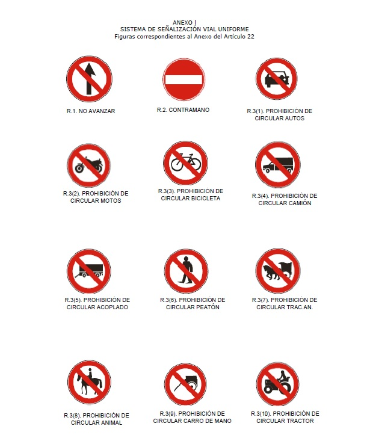

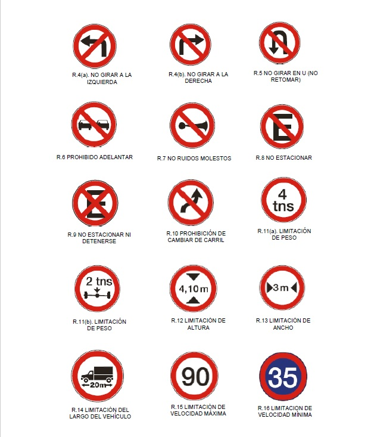

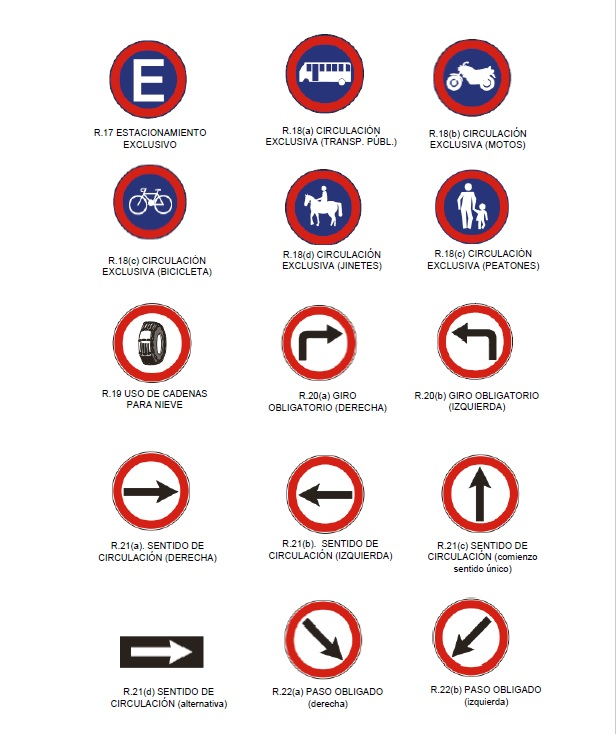

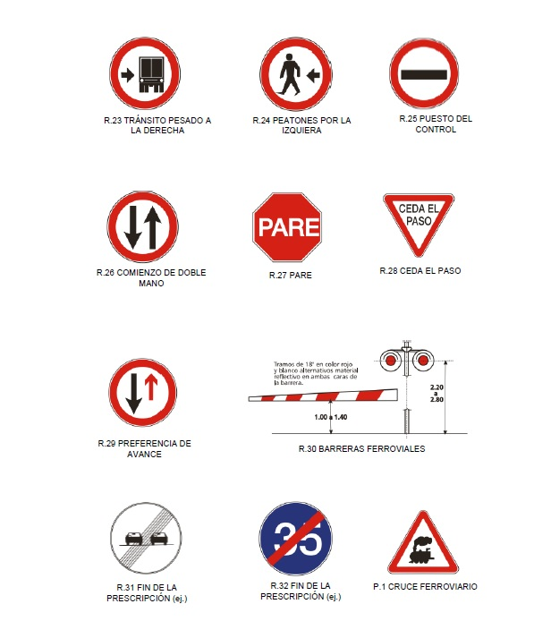

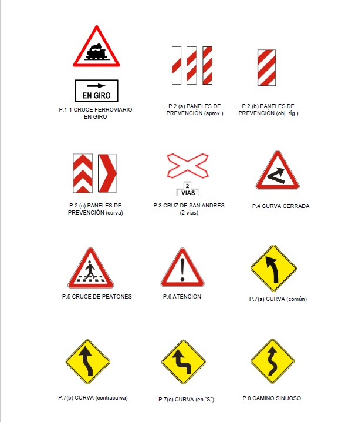

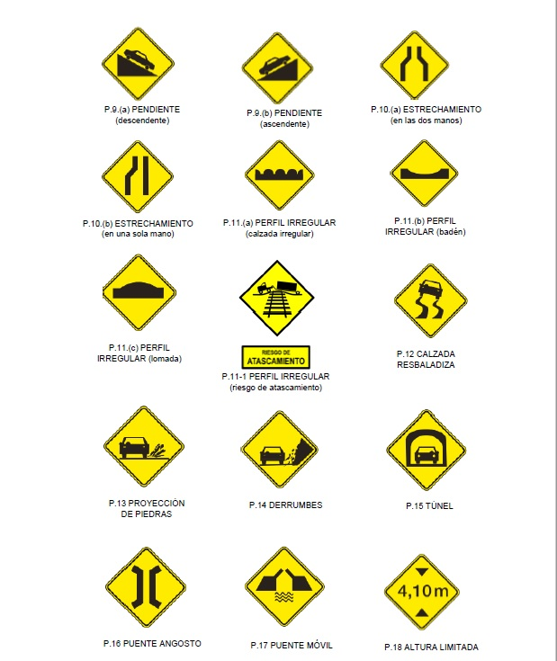

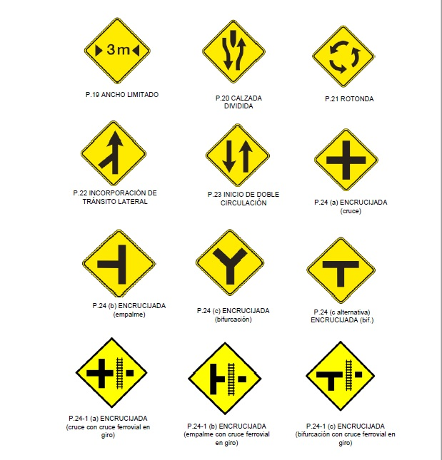

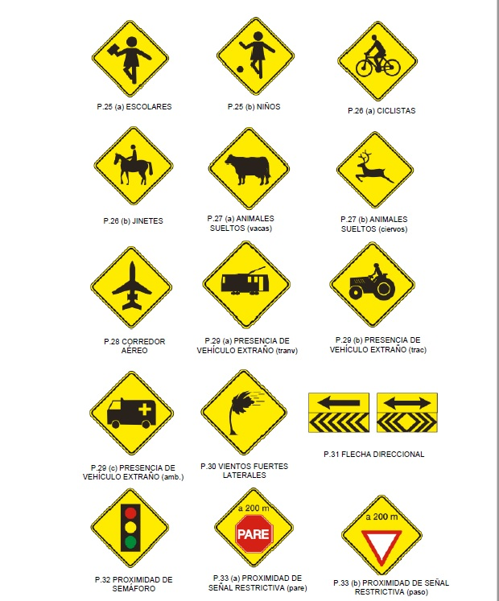

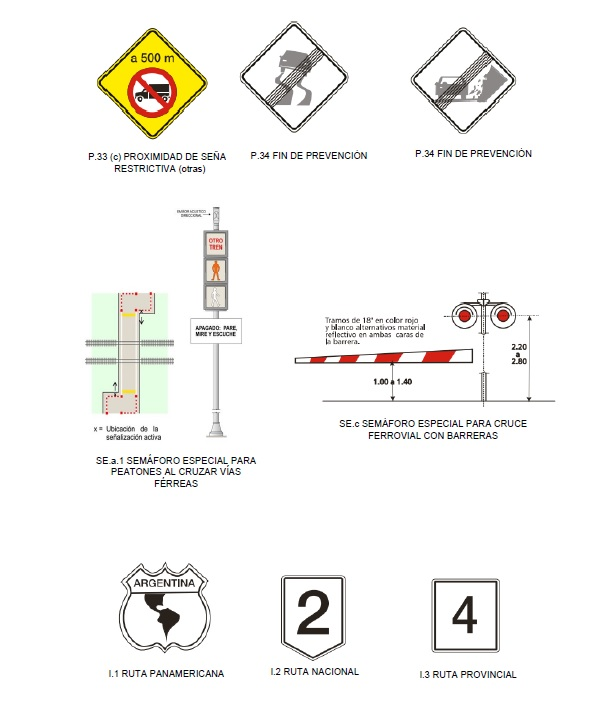

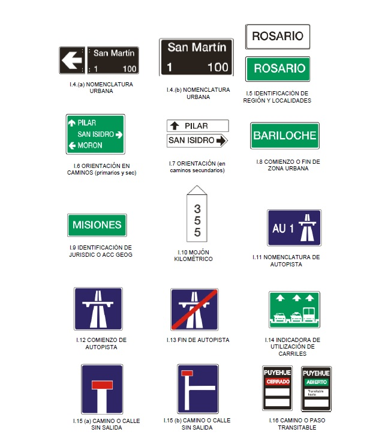

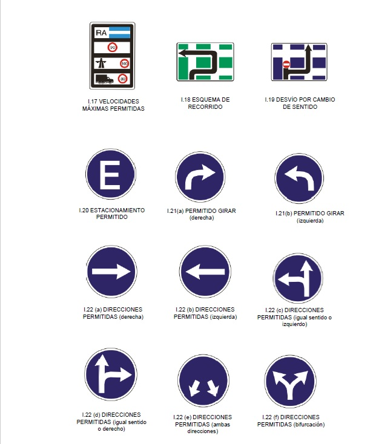

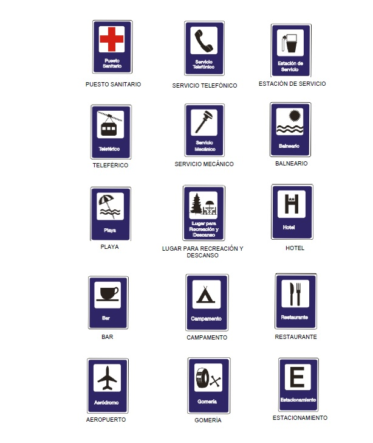

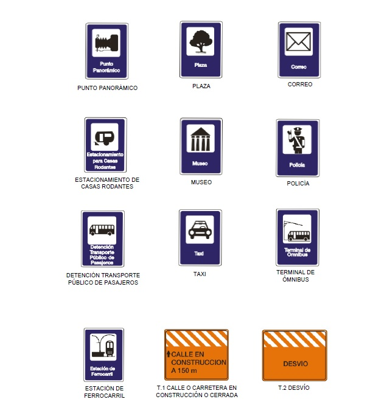

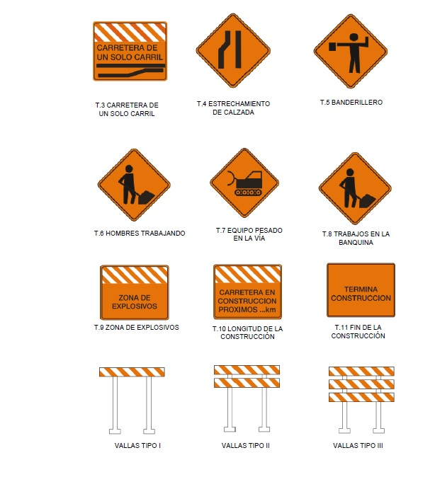

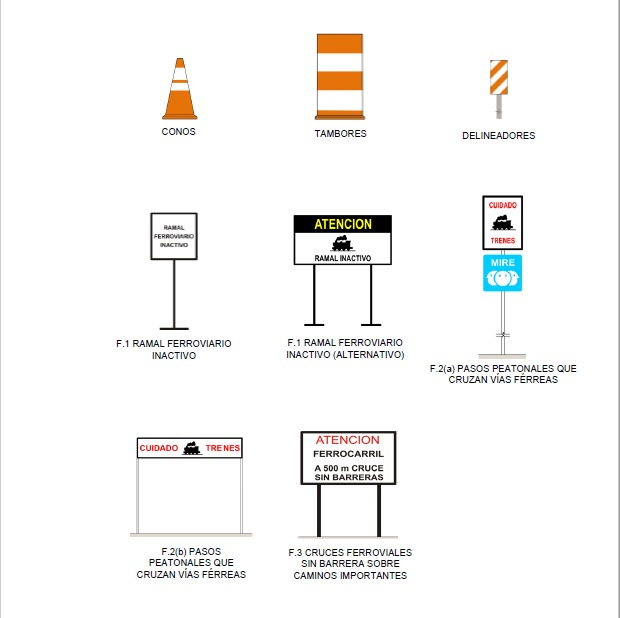

IF-2025-26417111-APN-SSTF#MEC
